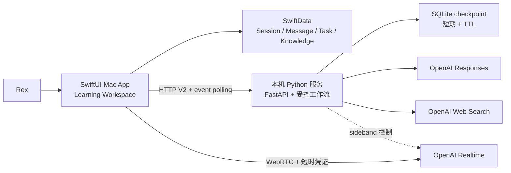
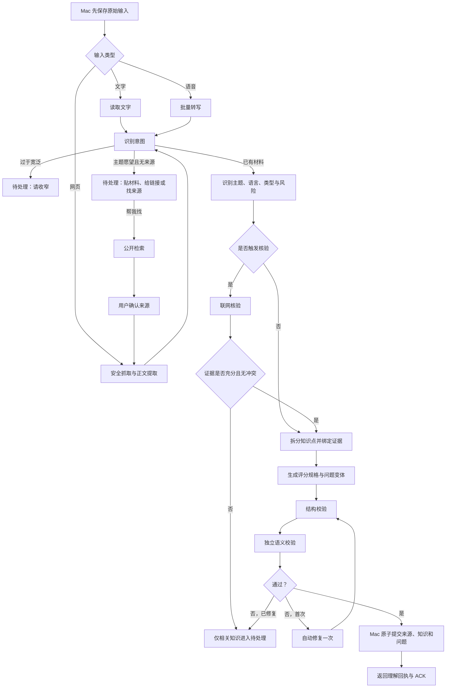
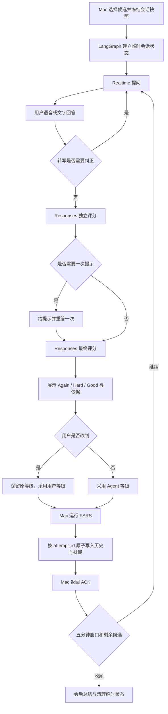

# Review Today Agent 与系统架构

## A006/A007 增量契约（2026-09-16，实施中）

复用消息、SSE、ACK 与恢复协议；增加可选澄清/纠错/续学意愿及目标引用。任务上下文携带稳定 goal_id、归属版本和当前承接位置，Mac 持久投影为长期事实，Python 对交接做跨会话原子版本校验。旧任务默认自身 ID 为独立目标，不按标题合并；交接保留已讲/自述/验证的真实证据，不复制保存授权。


## 主页面轻抬入增量（2026-09-13）

内容区复用现有淡入显示层并统一到 260 ms，外层局部 SwiftUI 显示位移由 24pt 回到 0。位移不参与布局尺寸，不保留离开的业务页面；只在主页面身份变化时触发。待启动任务在新切换、失活、减少动态及卸载时取消，直接归位事务禁止残留动画，快速连续切页不排队。侧栏与业务状态不加入动画事务。

## 主页面淡入增量（2026-09-13）

四个主页面的现有身份／卸载逻辑保持。局部原生显示层用同纸面颜色的覆盖层完成 150 ms 淡入（起始不透明度 0.65，结束为 0；修正旧版 0.16 过弱）；覆盖层不参与点击、焦点或无障碍，不持有页面内容，不逐帧修改 SwiftUI 业务状态。快速切换、减少动态和窗口失活移除动画，模型透明度始终为零，避免过期完成回调留下遮挡。显示层动效不作为数据查询／布局提速证据。

## 切页性能与结构整理（2026-09-13，已实现／已复查／性能目标未全部达标）

第一阶段收敛 Today 的活动投影、单一网格布局、Agent 当前会话查询与草稿写入，编辑器仅在文字／宽度／样式变化时重新布局。会话同步保持即时唤醒与兜底恢复，减少按会话反复全库扫描；旧任务兼容处理继续保留。新增内部快照与隔离性能验收入口，不改变对外服务协议、持久化 schema 或供应商配置，不跨线程传递 SwiftData 模型和 ModelContext。

第二阶段按职责拆分学习工作区、知识库管理、根导航协调与服务端上下文／模型调用／运行控制，保留既有业务入口和事务、revision、ACK 边界。无引用代码需核对正式、调试与测试入口后清理。两阶段分别验证，完成后统一提交；性能原始记录及结果见本轮验收增量。

活动数据在窗口独立观察节点中随数据变化生成，Today 切页复用有界值快照；侧栏与最近学习行只查询该会话的最新记录。输入框的焦点和高度由局部组件持有，恢复窗口不因此重建会话正文。服务端原入口继续代理上下文、模型执行和控制模块；可替换的模型调用与窗口策略在调用时注入，保持现有受控测试与运行扩展点。

压力采样发现 SwiftData Query 仍会在父页面更新时读取活动集合，仅隔离视图不足。活动观察改为窗口持有的同一 ModelContext 观察器：跟踪已投影模型的相关字段，并监听保存中的新增／删除与新完成活动，合并同一轮刷新；草稿保存不重读活动，停止后撤销监听。原生契约同时验证切页零投影、活动插入／改名／删除继续更新。

切页复查继续收敛两处重复工作：Today 每次构建先读取一次查询结果、计算一次显示统计，按钮点击时仍重新判断当前到期知识；侧栏状态在不含 Query 的会话身份边界内独立观察最新记录，导航选择不重新读取状态查询。状态新增、更新、删除与会话身份变化仍须由真实 SwiftUI 集成检查验证，不以冻结内容换取速度。

服务测试声明 `test` 可选依赖；`agent-service/run-controlled.sh` 使用 pytest 同时收集 unittest 与参数化听写测试，避免旧入口只导入文件却遗漏实际用例。测试仍使用临时库、空凭证和受控模型，不修改日常服务依赖与供应商设置。

## 本地交互响应增量（2026-09-13，已实现）

主导航的几何、悬停和焦点由独立视图持有，不与 AppSidebar 的 SwiftData 查询和会话列表共用高频状态。悬停动画仅附着绘制底板，避免动画事务传播到其他内容。输入方式只有变化时发布。

MascotWebSurface 为离线 ambient idle 载体保留最多两个已就绪缓存项；只有已卸载、未加载中且未失败的实例可重新借出。归还时关闭可见状态并清除旧 SwiftUI 回调，保留失效监听；重新借出绑定新协调器并应用当前配置。非待机、失败、未就绪和超额实例走完整释放。缓存不含业务数据，不复用 Mr. B 入库演出，不改变服务和持久化协议。

原生验证覆盖实际 SwiftUI 条件页面移除与重新挂载，确认 WKWebView 和文档身份保持，隐藏时停钟，旧回调隔离、失效和容量淘汰正常。证据与端到端性能边界见 [验证记录](evidence/2026-09-13-response/README.md)。


## 云端听写增量（2026-09-07）

原生主输入框通过 `/v2/dictation/transcribe` 上传单声道 PCM16 / 16 kHz WAV（最多 300 秒），请求头 `X-Dictation-ID` 使用 UUID；后台只在内存保留近期请求 ID，重复 ID 返回 409，不重新调用收费接口。北京 `fun-asr-flash-2026-06-15` 使用独立 `providers/asr/.env`，不改变文字模型供应商；不向供应商发送历史会话。

`/v2/dictation/clean` 只接收已识别文字，调用现有文字模型保守整理，返回原始文字、整理文字和成功标志；失败返回原文，不再次转写。原生在清理前先落盘原始文字，失败重试优先复用文字；草稿保存成功后清理录音及重试结果。终止录音/切换会话中断当前请求，旧响应按请求代际与草稿归属丢弃；本机音频和重试结果关联原草稿 UUID，删除会话同步清理。

录音存放于本机应用支持目录 `Review Today/Dictation`，后台不落盘。百炼可能依法保存调用数据；本机清理不代表云端删除，未确认供应商具体音频保留期限。海外上线前必须重新核对地域、Key、模型、数据政策与费用。旧章节中的本地转写、旧 Realtime 方案不适用于本轮听写。

> 文档状态：包含长期目标与当前实现；当前 M1 工程契约以 [Agent Harness V2 主规格](agent-harness-v2.md) 为准

## 0. 当前 M1 架构

2026-09-06 增量契约见 Harness §25：`ConditionalTeaching` 统一教学准备、真实搜索、网页读取、证据判断和可选本地关联，成功步骤沿用 Run checkpoint。Mac 收到绑定请求 ID / Run revision / lifecycle revision 的 `memory_lookup` 事件后，通过 `POST /v2/runs/{run_id}/memory-results` 回传最多 12 条候选；10 秒无结果跳过，模型可选零条。旧候选字段兼容，未发送草稿不进入公开查询或候选。

归档永久删除使用现有 Session actions 的 `delete` 动作。Mac 在同一 SwiftData 事务写入 AppSettings 的无正文删除标记、清理队列并移除会话实体；服务在 SQLite 事务中保存 tombstone 并删除旧/新检查点。离线 archive 先幂等回放，再清理服务；snapshot 恢复、导入、补索引和迟到结果不能复活会话。Knowledge 增加可空创建归属，只有证明独有的卡片才可随会话删除，其他卡片与排期独立保留。历史库工具仅导入来源、卡片、题目、排期和已有练习，不导入会话或任务 outbox。

本轮 UI 精修按 Harness §21 实施：根导航共用展开侧栏/图标栏状态与准确 Session ID；快捷开始元数据和预填来源只留 Mac 本地，原生编辑器执行安全追加/替换与撤销。单层菜单复用原偏好更新入口，不新建服务协议或更换 provider；新增测试复用 tests/mac 契约入口，真实窗口另验。此段为文档检查点目标，实施证据见验收 §0.14。

2026-09-05 供应商修订已实施：Rex 明确授权接入 DeepSeek 官方，契约见 Harness §20。独立 provider 选择隔离凭证与模型配置：路由/摘要于 2026-09-10 改用 V4.1 Flash 的官方 API 名称 `deepseek-flash`，教学配置保留 `deepseek-v4-flash`，风险判断配置保留 `deepseek-v4-pro`；旧 Luna/Terra/Sol 映射保留为可恢复历史配置，不作为自动备用。Responses 使用 system、等价内联 schema 引用和明确 JSON 约束，智能非思考、深入 high；最终仍经原类型和权限校验。启动按唯一模型去重探测，再分别记录 smart/deep 能力；deep 不可用不得被 smart 成功掩盖，也不阻塞已验证 smart。health 增加 provider/strengths，原 Mac 解码兼容；实际自托管服务已 ready。接入证据见验收 §0.13，下段 HTTP 403 为前批旧供应商记录。

当前目标以 Harness §19、§18 及未被覆盖的 §17 为执行契约。本轮增量已实施，下方 0.1 给出实际承载方式；新代码/测试与外部阻塞见验收 §0.12，旧 §0.10 保留历史。供应商本轮曾返回真实流式回答，但后续再次 HTTP 403；新增原生验收受锁屏阻塞，不混报通过。

- Mac 持久化生命周期版本和待发 Session 操作；服务 Session 级 action/snapshot 接口与新旧 Run/Task 共用 active/revision/授权检查。会话管理任务只走一个结果投影，兼容接口不另行生成。
- 控制、发送、事件接收、ACK 独立，ACK 只覆盖原子保存游标。回答先完成，版本化摘要后台维护。能力分类支持按角色准入、临时故障退避和明确拒绝时停探测；列表不作为调用能力唯一证据。
- Task 持久化版本化计划/步骤、理解、来源和小结；知识提交独立。公开材料快照复用，来源类型不可漂移；抓取逐跳/实际连接公网校验。
- Mac 长期事实来源包括恢复快照；Python 清理需终态/ACK/无活跃引用。恢复缺失检查点不执行模型，不覆盖非缺失服务状态。已加入 Session 连续恢复版本：事件携带完整投影或字段增量，Mac 原子合成与保存游标；32 版日志缺口回退完整投影，非法增量拒绝。旧磁盘增量迁移在隔离 fixture 验证，不伪造历史。
- 学习清单/Today/待处理只投影统一领域状态，视图不得通过文字推断完成/权限。品牌 OneWorks 与服务无运行依赖，不引入网页 SDK 到原生 App。

2026-09-04 修订：学习输入采用原生 NSTextView；消息和控制操作本地落盘后立即唤醒会话同步，与旧采集轮询分离。Session SSE 已接入，沿用现有事件顺序号、版本守卫与 ACK；SwiftData 保存部分回答、最终回答和草稿。最终校验前的文本预览不触发 Task 完成或知识提交。完整接口、兼容及验证约束见 [主规格 §15](agent-harness-v2.md#15-学习界面与实时反馈修订2026-09-04)。代码与受控测试已完成，Mac 锁屏使原生视觉验收仍未完成。

同日结构修订：根 `NavigationSplitView` 已成为唯一 Session 导航入口，Today、侧栏和学习区共享选择状态；Session 标签、AgentRun 活动语义与 ReviewAttempt 完成时间由 SwiftData 持久化，Today 在本地投影 26 周活动。代码与受控检查已完成，真实交互仍待 Rex 验收；契约见 [主规格 §16](agent-harness-v2.md#16-学习工作区结构与活动反馈修订2026-09-04)。

里程碑一不扩建通用 Agent 平台，但必须建立能够支撑连续学习的状态化 Harness：

```text
SwiftUI Learning Workspace
→ Mac 先独立持久化 Session / Message
→ 本机 FastAPI 立即接受 Message / AgentRun
→ 统一 IntentDecision 与程序授权
→ 对话能力或学习工作流异步执行并追加 Session Event / Task Event
→ SwiftUI 增量回放 Message / Event / Required Action
→ 用户在同一 Task 内选择、追问、回答或确认
→ 需要形成记忆时复用现有知识卡与 ACK 原子提交
```

自然语言回答保持原样，结构化的是路由、工作流状态、教学／问题输出、评分规格和评分结果。Session 不是把完整历史重复发送给模型；Harness 使用近期消息、结构化摘要、当前资料和少量相关知识组成受限上下文。

AgentRun、Session Event、Task Event、短期 checkpoint、严格 ACK、事件回放和 App 托管本地服务属于当前 M1。Realtime、WebRTC、语音、通知分发和正式安装仍是后续目标，不能据此宣称已经实现。Harness 仍不是通用多 Agent 平台。

### 0.0 Agent 起始与实施增量

从代码基线 67e8760 增量实施，文档检查点为 2a69931。Workspace 已区分 Today/Agent 起始/Library/Inbox 与具体 Session ID；不依靠 nil 自动挑选最近会话。`AgentComposerStore` 在 AppSettings 保存稳定起始 ID、正文与偏好；首条 Session/Message/outbox 和草稿消耗在同一 SwiftData 事务保存，失败可重试同一 ID。添加的卡片引用保存在可编辑草稿，不预先提交。

V2 兼容加入 Session/Run 的思考强度、类型化学习证据、引用策略版本和上下文容量；旧字段保留、安全默认迁移。记忆排除是独立策略动作，不归档、不执行原 Session，也不删除知识卡。新能力共用原状态守卫、SSE 与快照，不另建云端主库或外部向量服务。

本轮已补增量快照合成、稳定步骤改名映射、来源刷新和混合引用分支。全新计划由程序分配步骤 ID；已有步骤只接受可验证旧 ID，领域结构失败仅清理坏缓存。确认入库复用 capture 的生成节点，但经过同一个 Run `_call`，保留强度、停止、预算及已完成节点缓存；风险模型异常不伪装成知识冲突。现有输入/流式/清单/热力图继续复用；原生验收和 provider 实测分别留证。协作规则只记录决定，不将全局个人配置纳入仓库。

### 0.1 本轮新增职责与实际承载

保持 Mac 为长期事实来源、Python 为执行/checkpoint 层，不因跨会话记忆另建云端学习主库。复用现有 Session、Task、Message、Knowledge、ReviewAttempt 和事件 ID，不以一段自由文本摘要替代领域状态。

| 职责/增量数据 | 内容与写入边界 | 当前实现与限制 |
|---|---|---|
| 学习证据记录 | 稳定 ID、概念/范围、Session/消息/步骤出处、讲解/自述/独立评价类型、时间、提示使用、引用版本；不写正式知识/FSRS | `learning_memory.py` 生成类型化事件；Mac Session.learningEvidenceJSON 保存，答题证据定位刚答的步骤而非下一步 |
| 记忆使用策略 | Session 级允许策略/版本；排除使派生摘要/检索缓存失效，历史保留 | Mac 立即版本拦截；Session memory_policy 同步服务门禁；失效 Run 不再注入后续上下文，独立卡片不删除 |
| 关联检索上下文 | ID/版本/片段/关系/理解证据/时间，先限定允许范围再排序 | `LearningMemory` 使用原生分词/概念索引生成最多 12 条候选，Luna 同次意图选最多 2 个关联；无外部向量服务，弱词面相关的覆盖率仍需真实评测 |
| 用户执行偏好 | 每 Session 模式与强度，最近主动强度初始化新草稿；Run 固定有效值 | SwiftData 安全默认，set_thinking 持久动作；深入思考映射 high，兼容端点不降档。真实高强度调用因 403 未完成能力验证 |
| 上下文预算 | 实际构建内容、系统规则和 schema 的估计，预留与背景摘要版本 | 保守 UTF-8 字节估计；默认本地 24k/回答 4096。模型窗口未知只显示 token，不伪造百分比。关键状态超限拒绝静默裁剪 |
| 内部执行策略 | 统一步骤总时限/次数，受限主备与结构修复、真实模型诊断 | `execution_policy` 最多 2 次/默认 90 秒共享预算，关闭 SDK 重试；候选必须经批准且能力验证，实际名单为空，未启用备用 |

字段与兼容 schema 已通过服务/Mac 契约与隔离旧库迁移测试；新增字段采用安全默认/可空值，没有原记录支持的理解状态不回填为已验证。旧字符串知识上下文保留兼容，新的类型化引用优先使用；服务只选 Mac 给出的有效候选 ID，Mac 再验证出处、策略/内容版本及卡片状态，模型置信度不充当授权。

跨会话检索不允许执行原会话操作。归档 Session 仍可作为只读记忆来源；「不用于跨会话记忆」只改变独立使用策略，不恢复 Run、不修改正式卡片。排除来源及知识更新需使当前未提交的检索结果失效；已显示历史不被悄悄重写。必要原文回查只读取准确出处，不加载整库。

学习意图决定是否调用记忆，知识证据决定如何教学，程序决定能否写入。关系检索与缓存不必引入新的外部向量服务；如实施需外发数据或新增供应商，先明确数据范围与配置，不能把文档授权理解为任意上传。

主备在模型适配/执行层实现，沿用稳定可见回答 ID，内部 attempt 与供应商 response ID 分开；失败层不能各自无界重试。流式断线优先事件重放/协调，无法证明同一答案可续接时标记未完成；不能拼接不同生成结果冒充恢复。停止/归档/旧 revision、任务完成、知识 claim/ACK 均沿用共同守卫。主备变化不生成面向用户的供应商切换通知，只进脱敏开发诊断。

自动质量检查按风险分级：硬结构/权限检查、有限局部修复、必要证据查证；非每轮固定第二模型全文审核。回归样例必须断言可见结果和领域副作用，不只断言 HTTP 成功。测试范围与状态唯一登记在 M1 验收 §0.11。

语音 ASR/文本清理和双向实时语音是两条后续能力，模型均未锁定；下文 Realtime/WebRTC/sideband 仅保留历史候选架构，不证明已选型/已实现。当前文字 UI 不增加 React/Framer Motion 依赖，原生动效与服务状态解耦但受真实生命周期驱动。

## 1. 架构目标

系统采用“一个用户可感知的学习教练、四条受控学习工作流、一个本地事实来源”：

- 用户只面对一个 Review Today，不需要选择研究员、老师或评分员等多个 Agent 角色。
- 用户选择 Auto 或四个具体模式；内部统一识别意图并调度知识整理、资料学习、主题探索、问题攻克的局部能力或完整流程。每个 Session 同时只有一个前台执行，任务可以跨轮。
- AI 负责理解、生成和语义判断；确定性程序负责流程、权限、重试、写入和排期。
- 完整 Session、消息、知识与复习历史永远以 Mac 本地持久化为准。

## 2. 核心概念解释

| 名词 | 产品化解释 | 在 Review Today 中的作用 |
|---|---|---|
| LangGraph | 把 Agent 的工作拆成一张可暂停、分支、重试和恢复的流程图 | 编排采集整理和正式复习，不替代具体模型能力 |
| 节点 | 流程中的一个明确步骤 | 例如读取网页、风险判断、生成问题或答案评分 |
| 状态 | 一次任务当前携带的结构化工作资料 | 保存任务 ID、当前步骤、最小必要输入、错误和结果摘要 |
| 条件分支 | 程序根据明确结果决定下一步走哪条路 | 有风险才核验，有冲突才暂停相关知识 |
| Responses | 面向结构化文本、工具和 JSON 输出的 OpenAI 请求 | 整理知识、风险分类、生成评分规格和答案评分 |
| Realtime | 面向低延迟双向语音的 OpenAI 会话 | 播报问题、接收语音、VAD 和允许用户打断 |
| WebRTC | Mac 与 Realtime 之间适合实时音频的连接方式 | 让音频直接低延迟传输，Swift 不持有标准 API Key |
| WebSocket | Mac 与本机 LangGraph 服务之间持续传递控制事件的连接 | 同步会话状态、当前题、评分结果、提交确认和错误 |
| FSRS | 根据每次掌握表现计算下次复习时间的确定性算法 | 运行在 Mac，避免模型随意决定日期 |
| 幂等 | 同一请求因重试到达多次，最终也只产生一次结果 | `attempt_id` 防止一题被重复写入或重复排期 |
| 原子写入 | 一组数据要么全部保存成功，要么完全不生效 | 复习历史和 FSRS 新状态不能只写成功一半 |
| checkpoint | 工作流进行到一半时保存的短期恢复点 | Python 服务重启后可继续未完成任务 |
| TTL | 短期缓存的清理候选年龄 | 不能单独触发删除；须终态、已 ACK 且无活跃引用 |
| ACK | 接收方明确回复“已经可靠保存” | Mac 保存本题后确认，服务才允许进入下一题 |
| sideband | 除语音连接外，服务端对同一 Realtime 会话的控制通道 | LangGraph 监听会话、更新指令和处理工具事件 |

## 3. 组件职责



### SwiftUI Mac App

- 主窗口、学习工作区、Today、知识库、待处理和独立复习窗口；
- 录音与本地音频生命周期；
- SwiftData 中的 Session、Message、Task、Event 消费位置、知识和完整长期数据；
- 候选选择、固定会话快照、FSRS 和一题一事务；
- 启动、监控并恢复自己托管的本机 Python 服务；
- 先保存输入，再增量取得 Task Event、Message 与 Required Action；
- 决定用户最终改判和写入结果。

### 本机 Python 服务

- FastAPI 暴露本机 v1 兼容接口和 v2 异步接口，受控图执行四种学习工作流；
- 网页抓取、正文提取、风险规则和 SSRF 防护；
- OpenAI 标准 Key、模型角色配置和启动能力检查；
- Responses 与按风险触发的 Web Search；
- 短期 SQLite checkpoint、重试和结构化运行记录；
- 不拥有长期知识、FSRS 或最终复习历史。

### OpenAI 服务

- Realtime 在后续里程碑处理实时语音层；
- Responses 优先处理可验证的结构化理解与评分；若兼容供应端将请求标为完成却返回空结构化结果，服务仅针对该空结果改用 Chat Completions 的同一 Pydantic schema；
- Web Search 只在风险规则或模型分类触发时使用。

### 模型角色

- Luna：统一意图、指代、Session 关系、工作流选择及结构化摘要；纯问候、感谢、简单能力介绍和无副作用暂缓允许同次轻量回应，守卫见主规格 §15；
- Terra：教学、问题回答、记忆生成与普通验证；
- Sol：高风险事实与证据冲突判断。

角色与模型 ID 由配置映射，启动时按所需步骤检查；内部主备新规则见 Harness §18.6，必须保持用户强度与权限。当前代码的固定模型配置不因文档修改而变化，具体备用组合未经真实能力验证不能启用。

## 4. 旧采集整理图（v1 兼容；不得作为新消息入口）



### 关键控制

- 图决定何时调用工具，模型不能随意增加联网、重复生成或绕过冲突处理。
- 风险规则和模型分类使用“或”关系；宁可进入可解释核验，也不静默跳过高风险事实。
- 结构校验确认 JSON 形状正确；语义校验确认内容忠于来源且确实可复习。
- 任务只有收到 Mac 的本地提交 ACK 才能变为 `completed`。

## 5. 正式复习图



### Realtime 的权限边界

Realtime 可以：

- 播放当前问题；
- 检测用户是否开始或停止说话；
- 允许用户打断；
- 发送实时会话事件。

Realtime 不可以：

- 自己选择下一题；
- 自己修改评分规格；
- 自己决定掌握等级或 FSRS 日期；
- 绕过一次提示限制；
- 在 Mac ACK 之前进入下一题。

## 6. 数据边界

| 数据 | 长期位置 | Agent 服务可见范围 | 删除规则 |
|---|---|---|---|
| 学习 Session 与可见消息 | SwiftData | 当前 Session 的受限上下文 | 归档不删除；M1 不提供永久删除 |
| Learning Task 与事件消费位置 | SwiftData | 当前 Task、短期 checkpoint 与事件窗口 | Mac 保留完整记录；服务清理须终态、ACK 且无活跃引用 |
| 结构化 Session 摘要与交接包 | SwiftData | 当前调用需要的摘要 | 随 Session 保留，归档不删除 |
| 原始来源与证据 | SwiftData | 当前整理任务所需内容 | 用户删除且无其他知识引用 |
| 知识点与版本 | SwiftData | 当前任务或会话涉及的版本 | 按暂停、软删除、永久删除规则 |
| 问题和评分规格 | SwiftData | 当前题需要的规格 | 随知识版本管理 |
| FSRS 状态 | SwiftData | 服务不负责计算，只接收必要会话信息 | 随知识永久删除 |
| 复习历史 | SwiftData | 当前会话的最小上下文 | 用户永久删除或项目清理 |
| 正式复习音频 | Mac 本地文件 | Realtime 流式接收；Python 不落盘 | 滚动七天，Demo／POC 结束全删 |
| 语音采集音频 | Mac 本地文件 | 转写任务期间 | 成功后删除；失败时保留重试 |
| LangGraph checkpoint | 本机 SQLite（Demo 不加密） | 当前工作流状态 | 终态、已 ACK 且无活跃引用才可清理，不能因异常超龄直接删除 |
| Agent 运行事件与技术指标 | 运行中保存在 checkpoint；Mac 可保留脱敏投影 | 当前任务的节点、分支、调用、耗时、重试和错误码，不含隐藏思维链 | 正文随 checkpoint 清理；脱敏投影按调试周期清理 |

Mac 是长期事实来源。Python checkpoint 只是“任务做到哪里”的短期草稿，不能演变成第二份知识库。

### 6.1 五模式修订的数据与执行契约

新增 AgentRun 与 SessionEventRecord；AgentMessage.taskID 保持可空并增加发送状态。消息先写 Mac，Run/事件可离线续接，不按输入无条件建 Task/Source。Python checkpoint 维护 Session 活动 Run、版本、队列与停止状态；每个 Session 单一前台执行。模型返回后先检查版本再发布或写 Task，旧请求不得覆盖新意图。

Luna 的 IntentDecision 是建议，程序检查对象归属、确认 ID/版本、理解条件和攻克验收才执行；不允许客户端关键词猜测授权。明确操作同样通过服务端守卫。主规格 §8.1 定义 messages、Session events/ACK、runs/actions 的新增接口；旧 Task 接口、旧数据和 v1 继续兼容。

Mac 增加本地 Run、Session Event、待发操作和 Session 消费游标；事件与消息原子保存后 ACK。Run 可不关联 Task，资料草稿保留在会话；理解 unknown/self_reported/verified 与正式 FSRS 分离。来源 source_type=user_material/public_source/agent_generated 与证据状态分开；待选来源标记 public_source_candidate，确认获取正文后更新引用，生成讲义不是独立外部证据。

实际入口为 Swift `ConversationProcessor` → `/messages` → Python `ConversationHarness`；`IntentDecision` 负责语义，程序守卫负责授权。Session checkpoint 与兼容 Task 投影使用同一 SQLite 锁和事务；同一 Session 只有一个前台 worker。模型请求不占数据库事务，发布前校验 revision。明确按钮绑定对象版本，不额外调用 Luna。

Mac 写知识前领取 `commit-claim`：领取前新补充先冻结未提交草稿，停止/纠正可撤销；领取后按相同 ID 幂等写入并 ACK，不假装撤回已完成提交。消息、动作、Run、事件游标分别持久化；同会话失败控制保持顺序，但不阻塞其他会话。Python 已 ACK 缓存保留最近 64 事件和至少 32 消息及未完成输入，序号不重置；旧 Task 投影继续保留，完整记录由 Mac 保存。

以下旧字段草图仍为兼容基础，新契约优先；详细结构以代码 schema 和主规格共同维护。

### 6.2 领域模型草图

以下是 SwiftData 与本机接口的字段级起点。标识符用稳定 UUID，时间用绝对时间戳，日界按 Mac 本地日历解释。

**AgentSession（学习 Session）**

- `id`、`title`、`mode_preset`（`auto` / 四种工作流）、`status`（`active` / `archived`）
- `created_at`、`updated_at`、`archived_at`、`summary_id`
- `auto_topic_tags_json`、可空 `manual_topic_tags_json`、`topic_tag_revision`、`topic_tags_updated_at`；显示时人工值优先，清除人工值恢复自动
- 关联 Message、LearningTask、Source 与 Knowledge；归档不级联删除

**AgentMessage（可见消息）**

- `id`、`client_message_id`（用户消息幂等键）、`session_id`、`task_id`（可空）
- `role`（`user` / `coach` / `system_summary`）、`content`、`content_type`
- `created_at`、`status`（`local` / `accepted` / `failed`）

**AgentRun（单轮执行）**

- 既有 `id`、`session_id`、可空 `task_id`、状态、阶段、revision、attempt、耗时和错误字段继续有效；
- 新增可空 `activity_kind`（只允许 `knowledge_answer` / `lesson_step`）与 `completed_at`；只有最终结构校验与 revision 守卫通过的完成 Run 才能写入；
- 问候、输入、页面打开、失败、中断和未完成生成不写活动类型。重试与事件回放复用 Run ID，不重复累计。

**LearningTask（学习任务）**

- `id`、`session_id`、`mode`、`status`、`stage`
- `created_at`、`updated_at`、`retry_count`、`error_code`
- `required_action`、`last_event_seq`、`last_acked_seq`、`result_summary`

**TaskEvent（任务事件）**

- `event_id`、`session_id`、`task_id`、任务内单调递增 `seq`
- `occurred_at`、`stage`、`state`、`node`
- `user_summary`、`detail_summary`、`attempt`、`duration_ms`
- `error_code`、`recovery_action`、`required_action`、消息或结果引用

**SessionSummary（结构化摘要）**

- `id`、`session_id`、`version`、`goal`、`confirmed_decisions`
- `source_refs`、`knowledge_refs`、`open_questions`、`updated_at`

**SourceReference / KnowledgeReference（引用）**

- 稳定引用现有 Source / Knowledge，不复制完整正文；
- 记录 Session、Task、对象 ID、版本与用途。

**Source（来源）**

- `id`、`created_at`、`input_type`（`text` / `url` / `voice`）
- `raw_text`、`url`（可空）、`audio_path`（可空，成功整理后清空）
- `attribution`（客观主张 / 来源观点 / 个人想法）

**Knowledge（知识点）**

- `id`、`source_id`、`version`、`learning_goal`
- `knowledge_type`（`fact` / `concept` / `procedure`）
- `theme`、`content_language`、`question_language`、`answer_language`
- `evidence_excerpt`、`evidence_locator`
- `title`（卡片关键词：知识点名称，不是说明/描述句）
- `explanation`（卡片详解：一两句用户主语言拆解，必须能对回 evidence_excerpt）
- `lifecycle`（`active` / `paused` / `soft_deleted`）
- 暂停或软删除时保留历史；恢复后不制造逾期债务

**Question（复习问题）**

- `id`、`knowledge_id`、`knowledge_version`
- `variant_index`（`0` 主问题，最多两个变体）
- `prompt_text`
- `scoring_spec`：学习目标、必答点、同义表达、常见误解、证据、必要顺序

**CaptureTask（采集任务）**

- `id`、`status`（`queued` → `uploading` → `processing` → `committing` → `completed`，或 `retryable_failed` / `needs_attention` / `cancelled`）
- `source_id`、`created_at`、`updated_at`、`retry_count`、`error_code`

**ReviewSession（复习会话）**

- `id`、`mode`（`formal` / `preview`）
- `started_at`、`candidate_snapshot`（知识与问题 ID 列表，会话中冻结）
- `window_started_at`、`ended_at`、`end_reason`

**ReviewAttempt（复习尝试）**

- `attempt_id`、`session_id`、`knowledge_id`、`knowledge_version`、`question_variant_id`
- `mode`、`agent_grade`、`effective_grade`
- `created_at`、可空 `completed_at`；只有非 preview、ACK 成功且最终等级有效时写完成时间
- `hint_used`、`transcript_retry_count`、`early_review`、`degraded_path`
- `answer_text`（保留用户原始自然语言回答）、`fsrs_algorithm_version`、`fsrs_parameter_version`
- 提交需 Mac ACK；同一 `attempt_id` 不得第二次正式写入

**FsrsState（排期）**

- `knowledge_id`（每个知识点一份，变体共享）
- `due_at`、`stability`、`difficulty`、`reps`、`lapses`
- `algorithm_version`、`parameter_version`、`last_effective_grade`

**AgentEvent（旧运行事件）**

- v1 兼容结构；Harness V2 新任务统一使用 TaskEvent；
- v1 下线前产品进度、开发轨迹和恢复判断仍不得各自维护虚假状态。

**AppSettings**

- `daily_reminder_time`、`review_language_override`、`developer_mode`
- 开发模式下才允许 `force_due` / 跳过两小时等待；正式模式忽略

错误码采用 `RT.<AREA>.<CODE>`，例如 `RT.HARNESS.SERVICE_START_FAILED`、`RT.TASK.EVENT_GAP`、`RT.CAPTURE.NO_ACK`、`RT.REVIEW.VERSION_MISMATCH`。

## 7. 状态与接口契约

### 7.1 Learning Task 状态机

```text
accepted
→ queued
→ running
↔ awaiting_user
→ committing
→ completed
```

异常出口：

- `retryable_failed`：网络、临时服务、模型调用或可恢复结构错误；有限退避重试，也允许手动重试。
- `needs_attention`：冲突、证据不足、转写异常或语义校验失败；等待用户处理。
- `cancelled`：用户取消；保留可解释记录，不产生半完成知识。
- `terminal_failed`：当前约束下无法继续；显示原因和可行下一步。

`awaiting_user` 必须停止处理中动效并给出明确动作。客户端、Task 卡片和 Agent 运行记录必须使用同一个 TaskEvent 来源。旧 CaptureTask 状态机继续用于 v1 兼容任务。

### 7.2 复习尝试

每道正式题至少携带：

- `session_id`：本次正式复习会话；
- `attempt_id`：本题唯一尝试，用于幂等；
- `knowledge_id` 与 `knowledge_version`：避免旧结果覆盖新版知识；
- `question_variant_id`：记录使用的问题版本；
- `mode`：`formal` 或 `preview`；
- `agent_grade` 与 `effective_grade`：分别保存原判断和用户生效判断；
- `hint_used`、`transcript_retry_count`、`early_review` 和降级方式；
- `fsrs_algorithm_version` 与 `fsrs_parameter_version`。

`preview` 禁止写入 FSRS 与正式 POC 指标；接口层必须显式区分，不能只靠提示词约定。

### 7.3 通信方式

- 采集任务使用本机 HTTP：`http://127.0.0.1:8742`。
- 健康检查：`GET /healthz`。
- V2 Turn：`POST /v2/sessions/{session_id}/turns`。
- 任务快照：`GET /v2/tasks/{task_id}`。
- 增量事件：`GET /v2/tasks/{task_id}/events?after_seq=`。
- 用户动作：`POST /v2/tasks/{task_id}/actions`。
- 持久化确认：`POST /v2/tasks/{task_id}/ack`。
- 模型能力重查：`POST /v2/capabilities/probe`；只重新探测角色能力，不重复提交现有 Task。
- 正式复习的控制事件使用同一主机上的 WebSocket。
- 实时音频使用 WebRTC 直连 OpenAI Realtime。
- Python 使用 sideband 连接控制同一 Realtime 会话。
- 标准 API Key 不离开 Python；Swift 只收到短时 Realtime 凭证。
- Demo 不启用 TLS。HTTPS 留到远程部署。

V2 以上路径和主规格中的必备字段已经冻结；具体枚举与错误码随实现补齐，但不能改变即时接受、事件回放、动作幂等和 Mac ACK 语义。

Session 主题标签、归档状态和 Today 活动投影以 Mac SwiftData 为事实来源，不增加远程 Session 写接口。Python 通过现有 `IntentDecision`／Session Event 可选携带 `session_tags` 和运行活动语义；Mac 仍负责对象归属、revision、归档、完成条件和幂等检查。

### 7.4 Task Event 契约

每个 Learning Task 维护一条任务范围内、只追加的结构化事件流。它不是模型思维链，也不是另一份聊天记录；它只负责回答“这次任务实际走过什么路径、当前处于什么状态、为什么等待、失败后如何恢复”。

事件至少覆盖：

- 任务或会话开始、结束、取消与恢复；
- 节点开始、成功、失败与耗时；
- 条件分支及结构化选择原因；
- 模型请求、工具调用和规范化结果；
- 重试计划、实际重试次数和最终错误码；
- Mac 本地提交请求、ACK 与拒绝原因。

每条事件至少携带事件 ID、Session ID、Task ID、单调递增序号、时间、阶段、状态、节点、用户摘要、尝试次数和可选耗时／错误／恢复／等待动作。普通产品状态、展开详情、开发模式轨迹和恢复判断都从同一事件流与任务数据投影，不得各自维护另一套进度。

在任务和调试保留期内，模型实际看到的请求应能由 Mac 任务快照、来源或知识版本、提示词版本、模型配置和结构化参数重建。运行记录不因此保存隐藏思维链、完整密钥或不必要的知识正文；需要定位内容差异时使用本地引用、版本、哈希和脱敏摘要。

### 7.5 运行时不变式

以下规则不能只依赖提示词或人工验收，必须由程序在运行时检查并失败关闭：

- 没有 Mac ACK，采集任务不能进入 `completed`，复习服务也不能进入下一题；
- 同一任务 ID 或 `attempt_id` 不能产生第二次正式写入；
- `preview` 不能写入 FSRS、正式复习历史或 POC 指标；
- Responses 评分失败、取消或结果未通过结构校验时不能运行 FSRS；
- `knowledge_version` 不一致时必须拒绝提交，不能用旧结果覆盖新知识；
- 已记录的节点、工具调用和提交事件必须拥有可解释的结束状态，恢复时不能把未闭合事件误判为成功；
- checkpoint 完成或过期后必须清理正文，日志和事件不得包含密钥、Authorization 头、短时凭证或隐藏思维链。

每条不变式都需要稳定错误码、可归因的运行记录和至少一个能够真实触发违规的反向测试。具体检查位置随接口规格确定，但规则本身不得在实现中弱化。

## 8. 本地服务、失败与恢复

- **App 托管服务**：App 启动后检查 localhost 健康状态；无外部实例时启动项目配置的 Python 服务并监控自己启动的子进程；退出时只终止自己托管的实例。
- **启动失败**：用户消息已先保存，可能尚未创建 Task；显示解释、重试与诊断，不把“等待服务恢复”当作终态。
- **既有探测与等待基线**：真实结构化能力探测默认 45 秒，模型步骤默认 90 秒；探测与当前 Run 阶段分离。服务与协议可用时不让无关角色阻塞当前步骤。本机服务 30 秒无健康响应则有限重启，最多四次；系统权限由用户处理，不自动修改隐私设置。新内部主备/总重试预算与用户呈现目标以 Harness §18.6 为准，旧固定模型失败策略不能被当作新功能已实现。

- **App 重启**：从 SwiftData 恢复采集队列和正式会话；已完成题不重复，未完成题重新提问。
- **Python 重启**：从未过期 checkpoint 恢复；若无法恢复，Mac 保留原任务并重新提交同一任务 ID。
- **网络重复请求**：`attempt_id` 和任务 ID 返回已有结果，不重复写入。
- **知识被修改**：版本不一致时拒绝评分提交，重新生成适配新版本的问题。
- **Responses 失败**：不生成掌握等级，不运行 FSRS，允许重试。
- **Realtime 失败**：切换 macOS 系统语音朗读，再降级纯文字；完成记录标记降级方式。
- **网页失败**：保留 URL 和原任务，提示用户粘贴正文。
- **核验冲突**：只暂停受影响知识，不阻塞其他结果。
- **本地写入失败**：不返回 ACK，不进入下一题；恢复后继续当前题提交。

## 9. 安全与隐私边界

- Demo 服务只绑定 `127.0.0.1:8742`，不对局域网或公网开放，不启用 TLS。
- 标准 OpenAI Key 存在 `.env`，必须 Git 忽略；日志统一脱敏。
- URL 抓取阻止 localhost、私网、元数据服务、危险协议和重定向后的受限地址。
- 模型只能调用图允许的工具；提示词是行为引导，程序校验、工具白名单、状态机和写入规则才是硬边界。
- 不记录模型隐藏思维链；运行记录只保存结构化决策依据和摘要。
- 当前没有正式身份系统、远程多用户权限、邮件、支付、cron 或公网 webhook；不为这些未实现能力创建虚假设计。

## 10. 参考项目：借鉴与不借鉴

| 参考 | 借鉴 | 不借鉴 |
|---|---|---|
| [DeepTutor](https://github.com/HKUDS/DeepTutor) | 学习状态、待回答问题、题型感知掌握度、错误记录、来源追溯 | 完整教学平台、固定调度器、简单统一评分 |
| [agency-agents](https://github.com/msitarzewski/agency-agents) | 角色职责写法、提示词结构、评测、主动提醒和失败处理 | 多角色 Agent 作为用户界面或自主运行时 |
| [CobWeb 网页读取](https://github.com/RexYoung000/CobWeb/blob/master/src/lib/web-page.ts) | 公开网页读取与来源保留思路 | CobWeb 的产品定位、账户和知识蛛网 |
| [CobWeb 知识拆分](https://github.com/RexYoung000/CobWeb/blob/master/src/app/api/chat/extract/route.ts) | 知识拆分和来源追溯思路 | 草稿确认和自由聊天流程 |
| [Typeless](https://www.typeless.com/) | 低摩擦语音入口、历史记录、失败重试、隐私表达 | 通用听写定位、升级与使用统计首页 |
| [AirJelly](https://www.airjelly.ai/) | 一条侧栏承载主导航与会话、开放式 Agent 内容区、输入区锚定和就近恢复动作 | 品牌视觉、人物、积分、升级、文件夹、账户、通用工具、原始命令错误、持续屏幕采集与通用 Agent |
| [DeepSeek Harness](https://github.com/deepseek-ai/deepseek-harness) | 追加式运行事件、可重放生命周期、运行时不变式、回放测试和真实入口验收 | Cordis、“一切皆插件”、通用编码 Agent 循环、Shell／沙箱／子 Agent／长会话压缩，以及把开发预览版作为运行时依赖 |

## 11. 外部技术依据

- [OpenAI Realtime WebRTC](https://developers.openai.com/api/docs/guides/realtime-webrtc)：客户端使用短时凭证建立实时音频连接。
- [OpenAI Realtime server controls](https://developers.openai.com/api/docs/guides/realtime-server-controls)：服务端通过 sideband 控制同一会话。
- [OpenAI 数据控制](https://platform.openai.com/docs/models/default-usage-policies-by-endpoint)：用于区分 Review Today 自身不保存与平台安全日志边界。
- [LangGraph 概览](https://docs.langchain.com/oss/python/langgraph/overview)：状态化、可恢复的工作流编排。
- [LangGraph persistence](https://docs.langchain.com/oss/python/langgraph/persistence)：checkpoint、SQLite 和持久化机制。
- [DeepSeek Harness 架构](https://github.com/deepseek-ai/deepseek-harness/blob/master/docs/architecture.zh.md)：用于参考事件化运行事实、生命周期和能力边界；Review Today 不依赖其框架。
- [DeepSeek Harness 测试策略](https://github.com/deepseek-ai/deepseek-harness/blob/master/docs/testing.zh.md)：用于参考回放、真实入口和外部结果断言。

外部框架和文档只提供能力依据，最终产品规则以本仓库文档为准。

## 12. 相关文档

- [Agent Harness V2 主规格](agent-harness-v2.md)
- [产品需求与边界](product-requirements.md)
- [本机 Demo 实施与验收](demo-plan.md)
- [产品界面与体验方向](../DESIGN.md)
- [21 天 POC 验证方案](poc-validation.md)
- [决策记录](decision-log.md)

## 13. 当前实现与缺口

### 五模式修订已实现（2026-09-03，非用户验收）

`conversation.py`、`conversation_store.py`、`conversation_prompts.py` 与 Swift `ConversationModels` / `ConversationProcessor` 已替代新消息的强制四选一路由。普通对话无 Task，五模式工作流、独立作答/追问门槛、受控入库、会话事件恢复和结构化诊断已接入；旧数据和正式评分实现未删除。当前 107 项 Python 受控测试、原生持久化／输入／能力状态投影测试、Debug 本机签名构建与 Release 无签名构建通过；最新签名 App 已验证暂缓 Run 恢复和就绪态无全宽探测横幅，完整原生交互仍待复验。

真实模型已分别返回 Auto 答案、问题攻克首答与校准、知识整理草稿、资料学习生成讲义；原生 App 已检查轻量反馈、停止/恢复、重试后回答及重启持久化。最新签名 App 通过临时本地服务确认修复后的暂缓回复与能力状态表现；App 自托管重启仍受系统桌面文件夹授权阻塞，另有间歇模型 CONNECTION/TIMEOUT。完整四工作流、提交/复习 UI、权限恢复后的自托管和完整输入交互仍待验收。详细证据与下一步见主规格 §14、M1 验收 §0.8。

### 旧 V2 已实现（历史基线，不代表本轮五模式修订完成）

- SwiftUI Mac App、SwiftData 领域模型和本机 FastAPI 接口；
- `AgentSession`、`AgentMessage`、`LearningTask`、`TaskEventRecord`、`SourceReference`、`KnowledgeReference` 与 `SessionSummaryRecord` 本地模型；
- V2 异步 Turn、Task 快照、增量 Event、Action 与 ACK 接口，SQLite checkpoint、事件顺序、动作幂等、TTL 清理和重启恢复；
- 旧四工作流和 JD 的替身测试基线保留；本轮由主规格的新意图、授权、Auto 自动转接与主动选模式规则替代旧路由；
- 独立学习工作区、Session 列表／归档／恢复／结构化交接、输入即时回显、可展开运行详情和 Today 纯数据看板；
- Debug App 自动启动、监控并恢复项目 `.venv` 服务；模型清单加真实短生成能力探测、45 秒任务超时与显式可重试失败；
- OpenAI 结构化知识整理与独立回答评分调用；
- LangGraph 采集图，包含意图分类、提取、结构校验、语义校验、一次修复、风险判断和可选核验；
- 文字采集到知识卡、本地提交 ACK、文字问答、评分和基础 FSRS 界面路径；
- 基础任务事件摘要、服务健康检查与错误状态；
- macOS Debug 构建和旧模型服务级冒烟验证。

### 尚未完成或尚未证明

- 2026-09-04 冻结的单侧栏、开放式 Agent 工作区、Session 标签和 Today 活动投影已实施；旧第二 Session 栏／窄窗弹层已从当前学习页移除。侧栏拖宽恢复、归档中止、热力图跳转和系统偏好仍需在真实 App 中由 Rex 验收；
- 里程碑一尚未从真实 Mac App 入口完成端到端视觉与交互验收；
- Harness V2 已有服务端契约、固定模型替身和原生手动自检，但完整客户端自动化与更广模型质量评测尚未完成；
- 旧 V2 曾只走到模型超时；本轮已取得上述真实输出，但间歇网络异常和最新 Debug 的系统授权问题仍影响完整原生验收；
- V2 Harness checkpoint 已持久化；v1 `TaskStore` 与评分 ACK 仍主要保存在内存中，保留到 V2 用户验收后再迁移或删除；
- 复习评分目前是直接 API 调用，不是完整的正式复习 LangGraph；
- 正式提交已按“ACK 成功后才更新 FSRS 和 `effectiveGrade`，本地保存成功后才推进下一题”的顺序执行；
- 没有 OpenAI Realtime、WebRTC、sideband、VAD 和语音复习闭环；
- V2 Task Event 已可增量回放和恢复；跨版本事件迁移、长期诊断归档仍未建立；
- 模型角色已配置，结构化调用错误已分型；长期性能、精确上下文 token 限额与完整隐私审计证据仍未建立。

当前必须先由 Rex 验收已实现的 Harness V2，再关闭 #17 或进入 M2；不能以本文、自动化、构建成功或旧 capture 冒烟替代真实 Session 体验证据。
