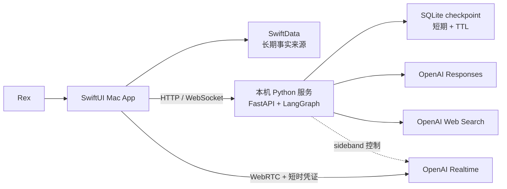
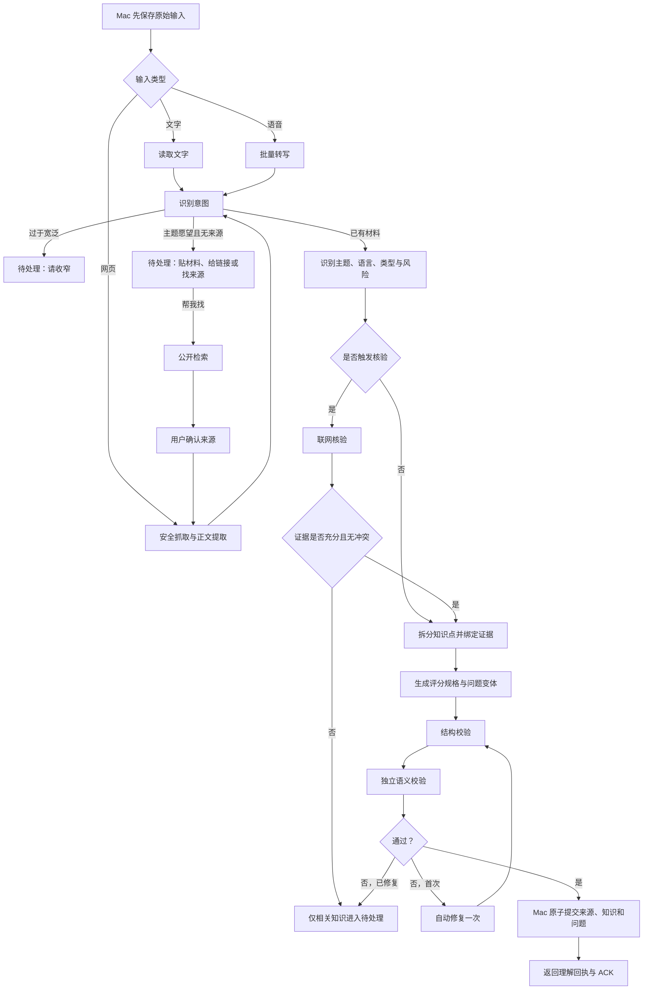
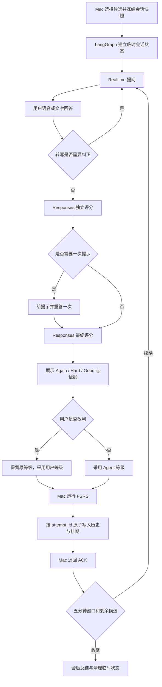

# Review Today Agent 与系统架构

> 文档状态：包含长期目标架构与当前实现说明；当前施工范围以 [最小闭环与渐进式里程碑](demo-plan.md) 为准

## 0. 当前最小架构

里程碑一不扩建通用 Agent 架构，只使用一条受控文字路径：

```text
SwiftUI 文字输入
→ 本机 FastAPI
→ LangGraph 采集整理图
→ OpenAI 生成知识卡、问题与评分规格
→ SwiftData 保存
→ SwiftUI 展示问题并接收原始文字回答
→ 独立 OpenAI 评分调用
→ 返回结构化等级与简短反馈
```

当前回答链路不增加“用户话术结构化”节点：自然语言回答保持原样，结构化的是评分规格和评分结果。这样可以先验证模型的真实语义理解能力，避免新增一次模型调用和误差来源。

本文后续的 Realtime、WebRTC、完整 checkpoint、严格 ACK、事件回放、通知与 FSRS 等内容是后续目标或需求池，不能据此宣称已经实现。Harness 的近期任务是收口真实流程、补齐恢复和可观测性，不是扩成通用多 Agent 平台。

## 1. 架构目标

系统采用“一个用户可感知的记忆教练、两条受控工作流、一个本地事实来源”：

- 用户只面对一个 Review Today，不需要选择研究员、老师或评分员等多个 Agent 角色。
- 内部用采集整理图和正式复习图拆分职责。
- AI 负责理解、生成和语义判断；确定性程序负责流程、权限、重试、写入和排期。
- 完整知识与复习历史永远以 Mac 本地 SwiftData 为准。

## 2. 核心概念解释

| 名词 | 产品化解释 | 在 Review Today 中的作用 |
|---|---|---|
| LangGraph | 把 Agent 的工作拆成一张可暂停、分支、重试和恢复的流程图 | 编排采集整理和正式复习，不替代具体模型能力 |
| 节点 | 流程中的一个明确步骤 | 例如读取网页、风险判断、生成问题或答案评分 |
| 状态 | 一次任务当前携带的结构化工作资料 | 保存任务 ID、当前步骤、最小必要输入、错误和结果摘要 |
| 条件分支 | 程序根据明确结果决定下一步走哪条路 | 有风险才核验，有冲突才暂停相关知识 |
| Responses | 面向结构化文本、工具和 JSON 输出的 OpenAI 请求 | 整理知识、风险分类、生成评分规格和答案评分 |
| Realtime | 面向低延迟双向语音的 OpenAI 会话 | 播报问题、接收语音、VAD 和允许用户打断 |
| WebRTC | Mac 与 Realtime 之间适合实时音频的连接方式 | 让音频直接低延迟传输，Swift 不持有标准 API Key |
| WebSocket | Mac 与本机 LangGraph 服务之间持续传递控制事件的连接 | 同步会话状态、当前题、评分结果、提交确认和错误 |
| FSRS | 根据每次掌握表现计算下次复习时间的确定性算法 | 运行在 Mac，避免模型随意决定日期 |
| 幂等 | 同一请求因重试到达多次，最终也只产生一次结果 | `attempt_id` 防止一题被重复写入或重复排期 |
| 原子写入 | 一组数据要么全部保存成功，要么完全不生效 | 复习历史和 FSRS 新状态不能只写成功一半 |
| checkpoint | 工作流进行到一半时保存的短期恢复点 | Python 服务重启后可继续未完成任务 |
| TTL | 短期状态允许存在的最长时间 | 到期自动删除 checkpoint 内容，避免形成云端知识库 |
| ACK | 接收方明确回复“已经可靠保存” | Mac 保存本题后确认，服务才允许进入下一题 |
| sideband | 除语音连接外，服务端对同一 Realtime 会话的控制通道 | LangGraph 监听会话、更新指令和处理工具事件 |

## 3. 组件职责



### SwiftUI Mac App

- 主窗口、菜单栏、通知和独立复习窗口；
- 录音与本地音频生命周期；
- SwiftData 数据模型和完整长期数据；
- 候选选择、固定会话快照、FSRS 和一题一事务；
- 向 Realtime 发送音频并展示转写与反馈；
- 决定用户最终改判和写入结果。

### 本机 Python 服务

- FastAPI 暴露本机接口，LangGraph 执行两条工作流；
- 网页抓取、正文提取、风险规则和 SSRF 防护；
- OpenAI 标准 Key 和短时 Realtime 凭证；
- Responses、Web Search 与 Realtime sideband 控制；
- 短期 SQLite checkpoint、重试和结构化运行记录；
- 不拥有长期知识、FSRS 或最终复习历史。

### OpenAI 服务

- Realtime 处理实时语音层；
- Responses 优先处理可验证的结构化理解与评分；若兼容供应端将请求标为完成却返回空结构化结果，服务仅针对该空结果改用 Chat Completions 的同一 Pydantic schema；
- Web Search 只在风险规则或模型分类触发时使用。

## 4. 采集整理图



### 关键控制

- 图决定何时调用工具，模型不能随意增加联网、重复生成或绕过冲突处理。
- 风险规则和模型分类使用“或”关系；宁可进入可解释核验，也不静默跳过高风险事实。
- 结构校验确认 JSON 形状正确；语义校验确认内容忠于来源且确实可复习。
- 任务只有收到 Mac 的本地提交 ACK 才能变为 `completed`。

## 5. 正式复习图



### Realtime 的权限边界

Realtime 可以：

- 播放当前问题；
- 检测用户是否开始或停止说话；
- 允许用户打断；
- 发送实时会话事件。

Realtime 不可以：

- 自己选择下一题；
- 自己修改评分规格；
- 自己决定掌握等级或 FSRS 日期；
- 绕过一次提示限制；
- 在 Mac ACK 之前进入下一题。

## 6. 数据边界

| 数据 | 长期位置 | Agent 服务可见范围 | 删除规则 |
|---|---|---|---|
| 原始来源与证据 | SwiftData | 当前整理任务所需内容 | 用户删除且无其他知识引用 |
| 知识点与版本 | SwiftData | 当前任务或会话涉及的版本 | 按暂停、软删除、永久删除规则 |
| 问题和评分规格 | SwiftData | 当前题需要的规格 | 随知识版本管理 |
| FSRS 状态 | SwiftData | 服务不负责计算，只接收必要会话信息 | 随知识永久删除 |
| 复习历史 | SwiftData | 当前会话的最小上下文 | 用户永久删除或项目清理 |
| 正式复习音频 | Mac 本地文件 | Realtime 流式接收；Python 不落盘 | 滚动七天，Demo／POC 结束全删 |
| 语音采集音频 | Mac 本地文件 | 转写任务期间 | 成功后删除；失败时保留重试 |
| LangGraph checkpoint | 本机 SQLite（Demo 不加密） | 当前工作流状态 | 完成后清理，异常按 TTL 到期删除 |
| Agent 运行事件与技术指标 | 运行中保存在 checkpoint；Mac 可保留脱敏投影 | 当前任务的节点、分支、调用、耗时、重试和错误码，不含隐藏思维链 | 正文随 checkpoint 清理；脱敏投影按调试周期清理 |

Mac 是长期事实来源。Python checkpoint 只是“任务做到哪里”的短期草稿，不能演变成第二份知识库。

### 6.1 领域模型草图

以下是 SwiftData 与本机接口的字段级起点，不是最终 schema。实现可以增加字段；不能删掉身份、版本、`mode`、ACK 与 FSRS 版本字段。标识符用稳定 UUID。时间用绝对时间戳，日界按 Mac 本地日历解释。

**Source（来源）**

- `id`、`created_at`、`input_type`（`text` / `url` / `voice`）
- `raw_text`、`url`（可空）、`audio_path`（可空，成功整理后清空）
- `attribution`（客观主张 / 来源观点 / 个人想法）

**Knowledge（知识点）**

- `id`、`source_id`、`version`、`learning_goal`
- `knowledge_type`（`fact` / `concept` / `procedure`）
- `theme`、`content_language`、`question_language`、`answer_language`
- `evidence_excerpt`、`evidence_locator`
- `title`（卡片关键词：知识点名称，不是说明/描述句）
- `explanation`（卡片详解：一两句用户主语言拆解，必须能对回 evidence_excerpt）
- `lifecycle`（`active` / `paused` / `soft_deleted`）
- 暂停或软删除时保留历史；恢复后不制造逾期债务

**Question（复习问题）**

- `id`、`knowledge_id`、`knowledge_version`
- `variant_index`（`0` 主问题，最多两个变体）
- `prompt_text`
- `scoring_spec`：学习目标、必答点、同义表达、常见误解、证据、必要顺序

**CaptureTask（采集任务）**

- `id`、`status`（`queued` → `uploading` → `processing` → `committing` → `completed`，或 `retryable_failed` / `needs_attention` / `cancelled`）
- `source_id`、`created_at`、`updated_at`、`retry_count`、`error_code`

**ReviewSession（复习会话）**

- `id`、`mode`（`formal` / `preview`）
- `started_at`、`candidate_snapshot`（知识与问题 ID 列表，会话中冻结）
- `window_started_at`、`ended_at`、`end_reason`

**ReviewAttempt（复习尝试）**

- `attempt_id`、`session_id`、`knowledge_id`、`knowledge_version`、`question_variant_id`
- `mode`、`agent_grade`、`effective_grade`
- `hint_used`、`transcript_retry_count`、`early_review`、`degraded_path`
- `answer_text`（保留用户原始自然语言回答）、`fsrs_algorithm_version`、`fsrs_parameter_version`
- 提交需 Mac ACK；同一 `attempt_id` 不得第二次正式写入

**FsrsState（排期）**

- `knowledge_id`（每个知识点一份，变体共享）
- `due_at`、`stability`、`difficulty`、`reps`、`lapses`
- `algorithm_version`、`parameter_version`、`last_effective_grade`

**AgentEvent（运行事件）**

- `seq`（任务内单调递增）、`time`、`task_or_session_id`、`event_type`、`node`
- `attempt_id`（可空）、脱敏 `payload`
- 产品进度、开发轨迹和恢复判断都从同一事件流投影

**AppSettings**

- `daily_reminder_time`、`review_language_override`、`developer_mode`
- 开发模式下才允许 `force_due` / 跳过两小时等待；正式模式忽略

错误码采用 `RT.<AREA>.<CODE>`，例如 `RT.CAPTURE.NO_ACK`、`RT.REVIEW.VERSION_MISMATCH`。全表随切片增长，不在开工前写死。

## 7. 状态与接口契约

### 7.1 采集任务状态机

```text
queued
→ uploading
→ processing
→ committing
→ completed
```

异常出口：

- `retryable_failed`：网络、临时服务或可恢复抓取错误；自动退避重试，也允许手动重试。
- `needs_attention`：冲突、证据不足、转写异常或语义校验失败；等待用户处理。
- `cancelled`：用户取消；保留可解释记录，不产生半完成知识。

客户端和 Agent 运行记录必须使用同一个任务状态来源。

### 7.2 复习尝试

每道正式题至少携带：

- `session_id`：本次正式复习会话；
- `attempt_id`：本题唯一尝试，用于幂等；
- `knowledge_id` 与 `knowledge_version`：避免旧结果覆盖新版知识；
- `question_variant_id`：记录使用的问题版本；
- `mode`：`formal` 或 `preview`；
- `agent_grade` 与 `effective_grade`：分别保存原判断和用户生效判断；
- `hint_used`、`transcript_retry_count`、`early_review` 和降级方式；
- `fsrs_algorithm_version` 与 `fsrs_parameter_version`。

`preview` 禁止写入 FSRS 与正式 POC 指标；接口层必须显式区分，不能只靠提示词约定。

### 7.3 通信方式

- 采集任务使用本机 HTTP：`http://127.0.0.1:8742`。
- 健康检查：`GET /healthz`。
- 正式复习的控制事件使用同一主机上的 WebSocket。
- 实时音频使用 WebRTC 直连 OpenAI Realtime。
- Python 使用 sideband 连接控制同一 Realtime 会话。
- 标准 API Key 不离开 Python；Swift 只收到短时 Realtime 凭证。
- Demo 不启用 TLS。HTTPS 留到远程部署。

每一刀只冻结该刀的路径、JSON 字段和错误码，并与代码一起进仓库。不要求开工前形成完整接口规格。

### 7.4 Agent 运行事件契约

每个采集任务和正式复习会话维护一条任务范围内、只追加的结构化事件流。它不是新的长期知识库，也不是通用聊天记录；它只负责回答“这次任务实际走过什么路径、当前处于什么状态、失败后如何恢复”。

事件至少覆盖：

- 任务或会话开始、结束、取消与恢复；
- 节点开始、成功、失败与耗时；
- 条件分支及结构化选择原因；
- 模型请求、工具调用和规范化结果；
- 重试计划、实际重试次数和最终错误码；
- Mac 本地提交请求、ACK 与拒绝原因。

每条事件至少携带单调递增序号、时间、任务或会话 ID、事件类型、节点、关联尝试 ID 和脱敏载荷。普通产品状态、开发模式轨迹和恢复判断都从同一事件流与任务数据投影，不得各自维护另一套进度。

在任务和调试保留期内，模型实际看到的请求应能由 Mac 任务快照、来源或知识版本、提示词版本、模型配置和结构化参数重建。运行记录不因此保存隐藏思维链、完整密钥或不必要的知识正文；需要定位内容差异时使用本地引用、版本、哈希和脱敏摘要。

### 7.5 运行时不变式

以下规则不能只依赖提示词或人工验收，必须由程序在运行时检查并失败关闭：

- 没有 Mac ACK，采集任务不能进入 `completed`，复习服务也不能进入下一题；
- 同一任务 ID 或 `attempt_id` 不能产生第二次正式写入；
- `preview` 不能写入 FSRS、正式复习历史或 POC 指标；
- Responses 评分失败、取消或结果未通过结构校验时不能运行 FSRS；
- `knowledge_version` 不一致时必须拒绝提交，不能用旧结果覆盖新知识；
- 已记录的节点、工具调用和提交事件必须拥有可解释的结束状态，恢复时不能把未闭合事件误判为成功；
- checkpoint 完成或过期后必须清理正文，日志和事件不得包含密钥、Authorization 头、短时凭证或隐藏思维链。

每条不变式都需要稳定错误码、可归因的运行记录和至少一个能够真实触发违规的反向测试。具体检查位置随接口规格确定，但规则本身不得在实现中弱化。

## 8. 失败与恢复

- **App 重启**：从 SwiftData 恢复采集队列和正式会话；已完成题不重复，未完成题重新提问。
- **Python 重启**：从未过期 checkpoint 恢复；若无法恢复，Mac 保留原任务并重新提交同一任务 ID。
- **网络重复请求**：`attempt_id` 和任务 ID 返回已有结果，不重复写入。
- **知识被修改**：版本不一致时拒绝评分提交，重新生成适配新版本的问题。
- **Responses 失败**：不生成掌握等级，不运行 FSRS，允许重试。
- **Realtime 失败**：切换 macOS 系统语音朗读，再降级纯文字；完成记录标记降级方式。
- **网页失败**：保留 URL 和原任务，提示用户粘贴正文。
- **核验冲突**：只暂停受影响知识，不阻塞其他结果。
- **本地写入失败**：不返回 ACK，不进入下一题；恢复后继续当前题提交。

## 9. 安全与隐私边界

- Demo 服务只绑定 `127.0.0.1:8742`，不对局域网或公网开放，不启用 TLS。
- 标准 OpenAI Key 存在 `.env`，必须 Git 忽略；日志统一脱敏。
- URL 抓取阻止 localhost、私网、元数据服务、危险协议和重定向后的受限地址。
- 模型只能调用图允许的工具；提示词是行为引导，程序校验、工具白名单、状态机和写入规则才是硬边界。
- 不记录模型隐藏思维链；运行记录只保存结构化决策依据和摘要。
- 当前没有正式身份系统、远程多用户权限、邮件、支付、cron 或公网 webhook；不为这些未实现能力创建虚假设计。

## 10. 参考项目：借鉴与不借鉴

| 参考 | 借鉴 | 不借鉴 |
|---|---|---|
| [DeepTutor](https://github.com/HKUDS/DeepTutor) | 学习状态、待回答问题、题型感知掌握度、错误记录、来源追溯 | 完整教学平台、固定调度器、简单统一评分 |
| [agency-agents](https://github.com/msitarzewski/agency-agents) | 角色职责写法、提示词结构、评测、主动提醒和失败处理 | 多角色 Agent 作为用户界面或自主运行时 |
| [CobWeb 网页读取](https://github.com/RexYoung000/CobWeb/blob/master/src/lib/web-page.ts) | 公开网页读取与来源保留思路 | CobWeb 的产品定位、账户和知识蛛网 |
| [CobWeb 知识拆分](https://github.com/RexYoung000/CobWeb/blob/master/src/app/api/chat/extract/route.ts) | 知识拆分和来源追溯思路 | 草稿确认和自由聊天流程 |
| [Typeless](https://www.typeless.com/) | 低摩擦语音入口、历史记录、失败重试、隐私表达 | 通用听写定位、升级与使用统计首页 |
| [AirJelly](https://www.airjelly.ai/) | 今日状态、主动式帮助、可管理记忆、任务进度 | 持续屏幕采集、通用 Agent、复杂工作台 |
| [DeepSeek Harness](https://github.com/deepseek-ai/deepseek-harness) | 追加式运行事件、可重放生命周期、运行时不变式、回放测试和真实入口验收 | Cordis、“一切皆插件”、通用编码 Agent 循环、Shell／沙箱／子 Agent／长会话压缩，以及把开发预览版作为运行时依赖 |

## 11. 外部技术依据

- [OpenAI Realtime WebRTC](https://developers.openai.com/api/docs/guides/realtime-webrtc)：客户端使用短时凭证建立实时音频连接。
- [OpenAI Realtime server controls](https://developers.openai.com/api/docs/guides/realtime-server-controls)：服务端通过 sideband 控制同一会话。
- [OpenAI 数据控制](https://platform.openai.com/docs/models/default-usage-policies-by-endpoint)：用于区分 Review Today 自身不保存与平台安全日志边界。
- [LangGraph 概览](https://docs.langchain.com/oss/python/langgraph/overview)：状态化、可恢复的工作流编排。
- [LangGraph persistence](https://docs.langchain.com/oss/python/langgraph/persistence)：checkpoint、SQLite 和持久化机制。
- [DeepSeek Harness 架构](https://github.com/deepseek-ai/deepseek-harness/blob/master/docs/architecture.zh.md)：用于参考事件化运行事实、生命周期和能力边界；Review Today 不依赖其框架。
- [DeepSeek Harness 测试策略](https://github.com/deepseek-ai/deepseek-harness/blob/master/docs/testing.zh.md)：用于参考回放、真实入口和外部结果断言。

外部框架和文档只提供能力依据，最终产品规则以本仓库文档为准。

## 12. 相关文档

- [产品需求与边界](product-requirements.md)
- [本机 Demo 实施与验收](demo-plan.md)
- [产品界面与体验方向](../DESIGN.md)
- [21 天 POC 验证方案](poc-validation.md)
- [决策记录](decision-log.md)

## 13. 当前实现与缺口

### 已实现

- SwiftUI Mac App、SwiftData 领域模型和本机 FastAPI 接口；
- OpenAI 结构化知识整理与独立回答评分调用；
- LangGraph 采集图，包含意图分类、提取、结构校验、语义校验、一次修复、风险判断和可选核验；
- 文字采集到知识卡、本地提交 ACK、文字问答、评分和基础 FSRS 界面路径；
- 基础任务事件摘要、服务健康检查与错误状态；
- macOS Debug 构建和一次真实模型服务级冒烟验证。

### 尚未完成或尚未证明

- 里程碑一尚未从真实 Mac App 入口完成端到端视觉与交互验收；
- M1 已有固定样本和服务端契约测试，但完整客户端自动化与更广模型质量评测尚未完成；
- Python `TaskStore`、评分 ACK 和任务事件主要保存在内存中，不是文中目标的 SQLite checkpoint + TTL；
- 复习评分目前是直接 API 调用，不是完整的正式复习 LangGraph；
- 正式提交已按“ACK 成功后才更新 FSRS 和 `effectiveGrade`，本地保存成功后才推进下一题”的顺序执行；
- 没有 OpenAI Realtime、WebRTC、sideband、VAD 和语音复习闭环；
- 运行记录不具备完整重放、内容重建和未闭合事件恢复能力；
- 具体 OpenAI 模型冻结规则、完整错误码、性能数据和隐私审计证据仍未建立。

后续应先完成最小文字闭环和质量评测，再根据已验证流程收口 Harness；不能以目标架构图替代实现证据。
