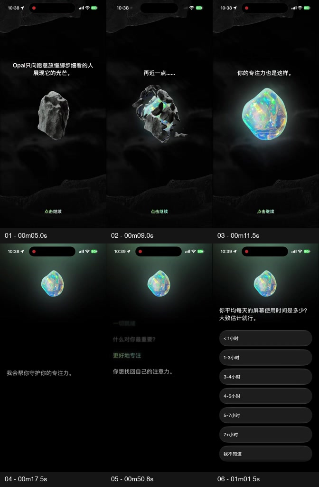
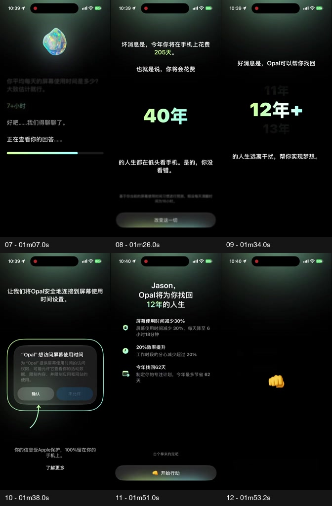
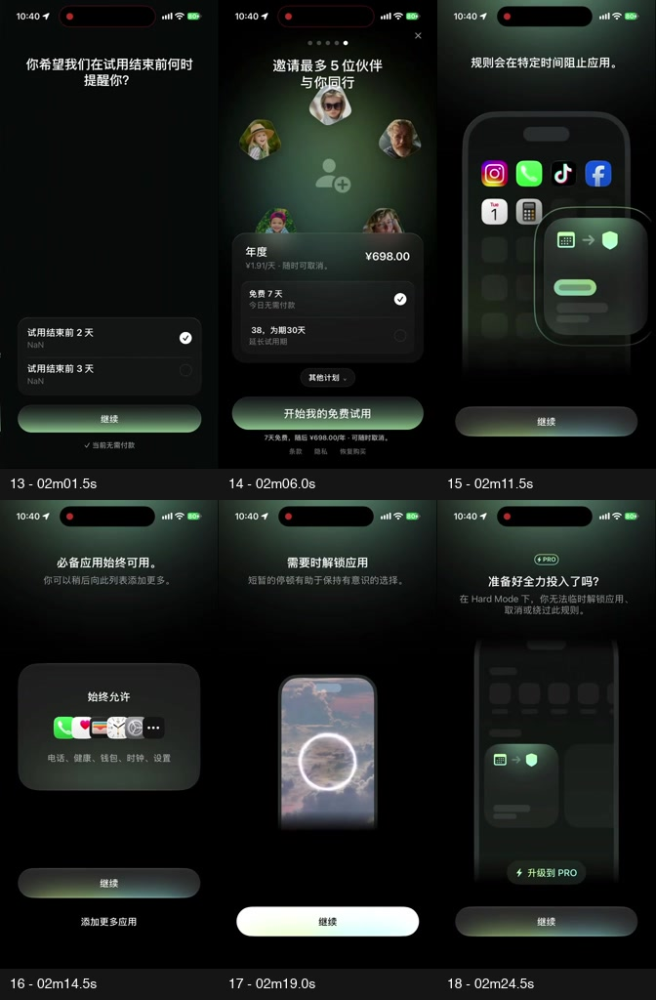
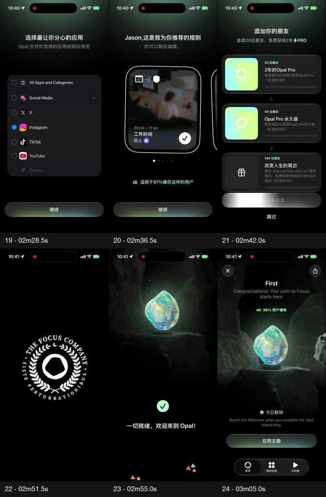

# Opal onboarding 设计案例：从发现宝石到建立专注规则

> 案例 ID：`opal-onboarding-2026-08-27`
>
> 研究日期：2026-08-27
>
> 用途：后续产品设计参考；不是 Review Today 的新增需求或已批准方向。
>
> 方法：UI Review。把录屏观察、官方产品说明、设计推断和待验证效果分开，不把视觉感染力等同于转化或留存。

## 速读结论

Opal 把“限制手机使用”重新解释为“保护并找回原本属于你的注意力”。它的优势不是单独一颗漂亮宝石，而是多个环节使用同一个意义：

```text
发现被岩石包裹的宝石
→ 把宝石与自己的专注力联系起来
→ 回答问题并收到针对性回应
→ 看见时间代价与改变的可能
→ 授权、面对试用选择、建立规则
→ 带着同一颗宝石进入首页和里程碑
```

最值得复用：先体验再解释、每次输入都有回应、关键操作前解释后果、品牌符号贯穿真实任务。不能直接复用：人生损失式施压、未经证实的改善数字、冗长问卷、商业化密度，以及 Opal 的品牌资产。

### 怎么看这份资料

- 看流程：第 2 节时间线和第 3 节四组分镜。
- 找可复用方法：第 4 节机制卡、第 5–6 节视觉与动态语言。
- 检查不能照搬的部分：第 7–9 节数字、隐私、风险及项目边界。
- 复看动作：[脱敏无声录屏](assets/opal-onboarding-redacted.mp4)。时间轴没有剪短，隐私区段有明确遮罩。
- 查媒体来源与时间点：[证据清单](evidence.json)。

## 1. 证据与边界

| 项目 | 本次依据 |
|---|---|
| 核心材料 | Rex 提供的竖屏 MP4；原文件名 `13b5413afed0c77c8198f0907fba16a2.mp4` |
| 长度与画幅 | 190.833 秒；448 × 960；原视频含音轨，平均约 24.68 帧/秒 |
| 观察范围 | iPhone 外观录屏，主要为中文界面；包含开场、登录、问答、系统授权、试用页、规则设置、邀请、完成和首页后的里程碑浏览 |
| 未知信息 | 精确 App 版本、iOS 版本、设备型号、是否参与实验分组、录制前的账户与权限状态 |
| 观察方式 | 分段抽帧与关键转场连续帧核对；存档保留正常时间轴，未做本机 Opal 交互测试 |
| 可支持的判断 | 这条路径里出现的内容、层级、状态顺序和可见变化；合理的设计机制推断 |
| 不支持的判断 | 全部用户都走同一路径、真实转化率、留存提升、实际节省年数、AI 生成文案、无障碍通过、原生渲染技术或完整功能可靠性 |

**存档处理：**只保留脱敏研究副本；登录资料、实际安装应用列表、系统分享对象区域被覆盖，音轨与来源元数据移除。原始文件不入库，账号、联系人和原始绝对路径不写入案例。关键帧均从脱敏副本提取。其余内容未重新设计，素材不得作为自有产品资产使用。

公开网页是访问日的补充证据，不等于录屏对应版本。研究过程中部分 `opal.so` 页面重定向到 `opalapp.com`，文末记录最终可访问来源。未下载官网字体、宝石模型、Logo 或宣传素材。

## 2. 全流程：用户做什么，以及设计在推进什么

时间为本段录屏中的约值，包含用户停留和系统等待，不是设计规定的时长。

| 时间 | 录屏观察 | 用户动作或可见状态 | 设计推断与边界 |
|---|---|---|---|
| 00:00–00:04 | Logo、岩石场景；约 00:03 出现追踪权限提示 | 处理系统弹窗 | 品牌气氛尚未建立就被打断；不能概括为“所有权限都在价值之后申请” |
| 00:04–00:15 | 岩石逐步显露宝石，文字把它与专注力联系起来 | 点击继续，看到逐层变化 | 先产生发现感，再赋予含义；不是用户真的用手势雕刻模型 |
| 00:15–00:23 | 宝石成为上方锚点；询问称呼，显示守护专注力的承诺 | 输入称呼 | 从展示对象转为对话对象；称呼不等于可信的个性化能力 |
| 00:23–00:43 | 登录选项、Apple 登录系统界面及等待 | 完成录屏中的登录路径 | 登录发生在问卷主体之前；细节已脱敏，未验证其他登录方式 |
| 00:43–01:04 | 目标、年龄、职业、每日使用时长；每题之后接回应 | 点选、输入；使用时长包含“不知道”选项 | 从用户目标进入资料收集，单次决策较小；不能证明所有字段都是必要的 |
| 01:04–01:14 | 查看答案的进度条，概括处境，称呼用户并引出授权 | 等待并继续 | 汇总制造被理解的感觉；无法确认是真实计算、规则分支还是生成式 AI |
| 01:14–01:35 | 时间损失与可找回年数依次出现，大数字滚动 | 继续行动 | 把抽象时长转换为人生价值；数字含预测与换算假设，不是已实现收益 |
| 01:35–01:49 | 屏幕时间权限说明、示意图、实际系统授权及通知提示 | 处理系统授权 | 解释页和系统页是不同表面；拒绝、撤回和恢复路径没有完整证据 |
| 01:49–01:55 | 个性化收益摘要、击拳约定和庆祝 | 开始行动 | 将意向变为承诺；此时仍不是一次成功的专注任务 |
| 01:55–02:08 | 免费试用引导、提前提醒选择、年度订阅页 | 选择提醒时间，浏览试用页后进入后续 | 未出现可确认的购买成功证据，不能写成“订阅完成”；提醒页可见 `NaN` |
| 02:08–02:16 | 建立规则的解释、必备应用始终可用 | 继续，可补充始终允许的应用 | 在设置限制前处理“会不会耽误正事”的担忧 |
| 02:16–02:26 | 临时解锁演示、短等待、Hard Mode 的限制与升级入口 | 观看演示并继续 | 普通模式可临时解锁的表达不能被泛化到 Hard Mode；此处为教程，不证明真实解锁运行 |
| 02:26–02:35 | 选择应用的演示，随后进入实际系统应用选择器 | 选择一项应用后返回 | 教程中的示例列表与真实安装列表不是同一份数据；后者已脱敏 |
| 02:35–02:41 | 工作时段、周末、时长等规则卡，显示可编辑及推荐比例 | 横向浏览推荐规则 | 把空白配置变为可理解的起点；推荐比例来源及真实个性化程度未核实 |
| 02:41–02:49 | 邀请好友与奖励梯级，系统分享面板 | 打开分享后返回；存在跳过路径 | 裂变被放在首次核心成果之前；不能由打开分享面板推断邀请已发送 |
| 02:49–02:58 | 徽章／品牌印记、宝石场景与完成庆祝，进入首页 | 完成引导 | 以仪式结束并保持视觉连续；“引导完成”不等于“使用目标完成” |
| 02:58–03:11 | 首页状态、设置提示、未解锁里程碑 | 浏览里程碑 | 说明宝石并非一次性开场资产，但尚未展示一次完整专注会话 |

## 3. 关键画面

以下为原画幅缩略图，时间标签位于画面外；每一帧的原尺寸图片与采样时刻见 `evidence.json`。遮罩是研究存档处理，不属于原 App 设计。

### A. 发现与对话



05s 岩石 → 09s 显露 → 11.5s 宝石 → 17.5s 对话开端 → 50.8s 目标回应 → 61.5s 使用时长。

### B. 从问题到改变意向



67s 查看答案 → 86s 时间代价 → 94s 改变希望 → 98s 权限解释 → 111s 收益摘要 → 113.2s 行动转场。

### C. 商业选择与控制边界



121.5s 试用提醒 → 126s 订阅页 → 131.5s 规则解释 → 134.5s 必备应用 → 139s 解锁演示 → 144.5s Hard Mode。

### D. 从配置进入持续使用



148.5s 选择演示 → 156.5s 推荐规则 → 162s 邀请 → 171.5s 品牌印记 → 175s 完成场景 → 185s First 里程碑。

## 4. 可复用的七个机制

以下都是从材料推导的设计方法，不是 Opal 团队公开确认的设计动机，也不是已证实的行为科学结论。

### P1：先让用户经历变化，再解释产品价值

**结构：**普通对象 → 低成本推进 → 发现隐藏价值 → 与用户处境建立联系。岩石和宝石使“注意力值得保护”有了可见对象。

**适合：**价值抽象、需要重新理解问题的产品。一次轻操作就应有有意义的反馈。

**复用边界：**隐喻必须能延伸到核心任务；不要为了“高级感”增加与产品无关的开场影片。紧急或高频工具不应反复播放。

### P2：收集一条信息，就返还一点理解

**结构：**问题 → 选择／输入 → 针对性回应 → 下一个相关问题。目标、职业和时长的回应，使表单获得对话关系。

**适合：**答案会真实影响后续内容或配置的场景。可用透明的确定性分支，不必引入 AI。

**复用边界：**不要只替换名字却宣称深度理解，也不要询问不会影响结果的信息。含“不知道”、更正与跳过的设计要结合真实依赖决定。

### P3：把功能指标换成用户能理解的结果

**结构：**原始指标 → 可理解的代价 → 可能的改善 → 下一步。这里用人生年数代替每天几小时，情绪强度显著上升。

**适合：**换算关系透明、用户关心该结果、且后续能以真实数据回看承诺的产品。

**复用边界：**先解释单位和假设，不把估算包装成事实。对学习、健康等场景尤其不能用未经验证的数字制造焦虑或保证效果。

### P4：减少同一时刻的竞争，而不只是减少页面数量

**结构：**当前内容清晰，历史内容降权；稳定对象维持方位，关键数字或动作获得临时主角地位。

**适合：**分步理解、回答、设置和专注任务。阅读与操作区域应稳定，重要说明仍可找到。

**复用边界：**低单步负担不等于低总成本。模糊历史不能妨碍回看、更正或辅助技术；不能用降权隐藏价格、拒绝或风险信息。

### P5：在请求操作前，先回答它的理由与后果

**结构：**用户目标 → 为什么需要这个动作 → 具体后果与替代路径 → 实际系统操作。

**适合：**权限、账号、导入、付费及其他会让用户犹豫的节点。

**复用边界：**说明页不能冒充系统授权，也不能用情感承诺替代具体数据用途。案例开场的追踪提示是时机安排的反例。

### P6：把“愿意改变”接到一个能编辑的起点

**结构：**解释规则 → 消除必要应用被误伤的担心 → 教会临时退出／严格模式区别 → 给出初始配置。

**适合：**空白设置成本高、系统能给出可信默认值的产品。

**复用边界：**解释清楚哪些已生效、哪些只是预览；不能把“推荐”当成已同意。规则真正生效、撤销、修改和异常恢复需要实际验证。

### P7：让品牌符号参与长期关系，而不是只做一次表演

**结构：**发现对象 → 对话锚点 → 完成反馈 → 首页状态与里程碑。用户对同一对象的认识随使用逐步积累。

185s 的 First 宝石页明确显示：完成 onboarding 即可解锁，录屏中已标为当日解锁。这是开场对象与第一份收藏的直接衔接；奖励的是“完成引导”，不能把它当作已经完成专注任务的证据。

**适合：**存在持续任务与可解释进展的产品；符号应服务真实状态或成果。

**复用边界：**不要把用户变成符号的维护者，不要用永远无法达成的奖励制造欠缺感。官方社区存在一条 2023 年的历史反馈：用户不喜欢一直看见自己已不可能获得的早期用户宝石。它只是反例线索，不代表当前版本或多数用户结论。[社区原帖](https://community.opalapp.com/t/original-gem-as-bonus-but-removed-for-non-early-adopters/988)

## 5. 视觉语言：哪些有来源，哪些只是观察

### 5.1 可核对的官方品牌信息

官方 Partner Brand Kit 给出黑白核心、灰色辅助文字和表面，以及用于 App 特定时刻的渐变；字体家族标为 SF Pro Text。以下数值来自官网，不是对压缩录屏的反向测量。[Opal Brand Kit](https://brandkit.opal.so/)

| 角色 | 官网标注 |
|---|---|
| 背景 | `#000000` |
| 主文字 | `#FFFFFF` |
| 次要文字 | `#BCBBC0` |
| 表面 | `#3A3A3A` |
| 一组与录屏气质接近的渐变 | `#D4FF9C → #9EF9FF`；不证明录屏逐像素使用该值 |
| 字体 | SF Pro Text；中文实际回退字体未核实 |

这是一份对外合作素材规范，不是本段 App 的完整组件代码或交互规范。其渐变使用限制不能直接当作对录屏内局部环境光的违规判定，也不能变成 Review Today 的设计令牌。

### 5.2 录屏中能看到的选择

- **材质对比：**粗糙、不规则的岩石，与高亮、通透、虹彩宝石形成价值显露的对比。
- **空间与层级：**洞穴像展台；进入问答后压缩环境，给文字与动作让位。
- **颜色分配：**大面积低彩背景，少数对象、重点数字与行动区域使用光彩；并非每张卡都加特效。
- **字号与密度：**一句主叙述、单题选项或单个大数字成为当前焦点；年数页刻意放大情绪而非信息密度。
- **形状：**圆角／胶囊操作区域、柔和光晕，与不规则宝石、岩石形成对比。
- **品牌连续性：**对象、色光、印记和首页场景互相呼应，而非每一步更换一种插画风格。

没有从视频推导未经验证的圆角半径、字体点数、弹簧参数、色彩对比通过值或渲染库。压缩画面不能还原完整设计系统。

## 6. 动态语言：把动画理解为状态表达

| 片段 | 可见变化及作用 | 复用时需要验证 |
|---|---|---|
| 岩石显露宝石 | 连续对象变化承载发现与价值揭示 | 点击是否可重复、跳过或中断；Reduced Motion 如何表达同一含义 |
| 宝石移动至上方 | 同一对象从主视觉变成对话锚点 | 不遮内容；适应键盘与窗口变化；不能抢走任务焦点 |
| 问答推进 | 旧内容降权，回应与新问题依次进入 | 回看与改答、焦点顺序、屏幕阅读器是否能获得同等信息 |
| 年数滚动 | 用逐步抵达的数字营造预期 | 最终数值清楚且可静态阅读；不要误导为实时测量 |
| 查看答案进度 | 把等待放入“正在理解”的语境 | 进度需对应真实状态；不为戏剧感故意制造假处理时间 |
| 临时解锁演示 | 等待、视觉变化与解锁状态建立联系 | 教程与真实操作一致；紧急使用与严格模式的不同后果要明确 |
| 击拳、印记、完成庆祝 | 标记关系与流程阶段变化 | 不能把配置完成误当学习／专注成功；重复使用时不强迫观看 |

这是对状态与顺序的分析，不是帧率、手感、原生性能、震动、音效或 Reduce Motion 的验收。副本已去音轨；如要研究声音，需另取经过隐私核对的原始音频。不能从位图观感断言使用 SceneKit、Rive、Spine、实时 3D 或预渲染视频。

## 7. 再研究后的三个关键判断

### 7.1 开场承诺在后续产品里有承接，但不是效果证明

官网将宝石列为 Focus Gems 里程碑；帮助文档也说明 Focus Report 会呈现使用时间、清醒时间占比和年数等信息，并允许更新注册时填入的初始使用时长。这支持“同一价值表达持续使用”的判断，不证明这套 onboarding 的转化效果或某个用户能节省多少时间。[产品主页](https://opalapp.com/) · [Focus Report 说明](https://opalapp.com/help/what-is-focus-report)

后者的各平台表述有不同段落与限制，不能据此假设 iPhone、Android、Mac 体验完全一致；本案例只分析所给 iPhone 外观录屏。

### 7.2 205 天不应直接理解成 205 个全天

录屏结果页展示“减少 30% 后每天 6 小时 18 分”，年数页小字提及每天清醒 16 小时。可以做一个**一致性核算**：

```text
6 小时 18 分 = 6.3 小时
6.3 ÷ 70% = 9 小时（从结果倒推的基线）
9 ÷ 16 × 365 ≈ 205.3 个“16 小时清醒日”等价值
205.3 × 30% ≈ 61.6 → 约 62 天
40 年 × 30% = 12 年
```

这组关系能解释画面数字如何相互一致，却**不能证明产品实际采用这套算法**。用户选的是“7+小时”，为何按 9 小时计算、40 年使用了何种寿命与时间范围假设，都没有确认。按普通 24 小时日换算，9 小时 × 365 ÷ 24 约为 136.9 天，而非 205 天。

复用这种呈现时，必须把输入区间、基线、时间单位、预期改善和预测跨度说清楚；不能以更有冲击力的单位替代用户通常理解的单位而只靠难读小字解释。

### 7.3 屏幕时间、追踪、通知与购买不是同一种同意

录屏中几类请求都出现过，不能笼统写成“用户授权后开始使用”：

- 屏幕时间权限：与限制应用的核心功能相关，官方帮助页说明此依赖；本案例不额外认证其实现。[权限说明](https://opalapp.com/help/why-do-you-need-to-grant-screen-time-api-access)
- 追踪权限：开场单独出现；不能因为核心功能需要屏幕时间权限，就把追踪也说成必要。
- 通知：和提醒相关；选择提醒日期不证明通知一定会送达。
- 试用与购买：画面中的价格、周期与免费选项只代表录制时展示，不是当前报价，也不是订阅成功证据。

官方数据说明包含本地处理原则，也谈到产品改进数据和崩溃数据例外。因此录屏中“100%留在手机”的宽泛表述，不宜被转述为“所有类别的数据都绝不离开设备”。这是语义范围提醒，不是对实际数据流或合规性的审计。[数据说明](https://opalapp.com/help/what-do-you-do-with-my-data)

## 8. 不宜照搬的部分与验证方法

以下严重程度只针对复用这种设计时的风险，不是对 Opal 全产品作最终审计结论。

| 级别 | 事实／证据 | 用户影响 | 复用建议与验证 |
|---|---|---|---|
| Important | 约 02:00 试用提醒选项下出现 `NaN` | 涉及提醒和扣费的节点显得不可靠 | 不把异常值展示为日期；检查不同语言、时区、日期与数据缺失；验证提醒实际安排与送达，不只检查排版 |
| Important | 人生数字占主视觉，假设只在较弱层级；输入为区间 | 容易将估算、清醒日等价值或预期改善当确定事实 | 在主信息附近解释单位和假设；让用户复述含义并核对计算。若新设计把未经证实效果写成保证，应阻止该版本上线 |
| Important | 约 00:03 的追踪提示早于主要价值解释 | 打断开场，也可能让用户混淆追踪与必要权限 | 逐项确认用途与申请时机；测试拒绝后核心功能的真实路径，不能只做允许路径 |
| Important | 试用、Hard Mode 升级、邀请均在首次完整专注成果之前出现 | 启动成本可能偏高，用户尚未获得核心价值就面对商业动作 | 对比更早完成首次核心任务的版本；看首次任务完成与后续使用，而不只看付费页点击 |
| Optimization | 对话与大数字存在等待和阶段性演出 | 首次可能有感染力，重装或熟练用户可能觉得拖沓 | 测试跳过、恢复、返回改答及快速连续输入；不要把录屏停留秒数当强制动画时长 |
| Optimization | 收藏中存在未解锁对象；历史社区有不可达奖励的负面反馈 | 可持续激励也可能变成永久欠缺感 | 区分可达、限定、已结束目标；测试用户是否理解条件，避免为纯收藏强迫社交 |

**仍未覆盖：**VoiceOver、Dynamic Type、Reduce Motion、横竖屏／不同尺寸、弱网、取消登录、拒绝或撤回权限、购买取消／恢复、提醒实际送达、真实屏蔽与解锁、断点恢复、回看改答、首次任务结果及长期使用。

付费页有关闭入口，邀请页也存在跳过路径；不能为了批评而声称该录屏强迫购买或强迫分享。也不能因为这些入口可见，就认定所有拒绝路径都经过验证。

## 9. 对 Review Today 的参考边界

当前执行基线是 [M1 纯文字最小闭环](../../demo-plan.md)，不是 onboarding、语音、角色动画或商业化。长期 [DESIGN.md](../../../DESIGN.md) 仍规定不做独立首次启动引导、一次一题、主动但不催促、角色服务内容。

下表只是未来对齐时可使用的候选映射，**未批准、未排期、未实现**：

| Opal 的机制 | 可讨论的 Review Today 应用 | 不能顺手扩成什么 |
|---|---|---|
| 先经历再解释 | 让用户用自己的内容完成一次“输入 → 问题 → 回答 → 有依据的反馈”，从真实成果理解价值 | 一段阻挡首次使用的品牌开场影片 |
| 每次输入都有回应 | 采集回执说明理解了什么；答题反馈对应具体遗漏或正确点 | 为了“懂你”新增年龄、职业、目标长问卷，或凭空宣称理解用户 |
| 同一对象贯穿流程 | 已有复习老师角色在采集、倾听、反馈中表达同一关系 | 换成宝石、复制洞穴风格、把角色变成需要喂养的宠物 |
| 当前内容聚焦 | 维持一次一道题，历史与辅助信息按需查看 | 依赖模糊特效隐藏证据、更正入口或重要说明 |
| 动作前说明理由 | 在真实触发语音／提醒时说明具体用途与替代路径 | 增加全屏强制权限向导或改变已确认的状态行策略 |
| 可编辑的起点 | 在功能进入对应阶段后，提供可解释的推荐与调整入口 | 在 M1 偷加排期、通知、游戏化或商业转化链 |
| 可回看的价值表达 | 用已经发生的学习结果说明变化，允许修正判断 | 宣称“永久记住”“节省多少年”或用遗忘焦虑施压 |

在新的项目中引用本案例时，也要先检查目标用户、任务频率、平台与当前阶段，不能把 Review Today 的映射反过来当所有产品的通用方案。

## 10. 外部来源与可信度

均于 2026-08-27 访问；未验证与本录屏的版本一致。外部内容仅做必要摘要，不镜像网页或下载素材包。

| 来源 | 本次用途 | 不代表什么 |
|---|---|---|
| [Opal Brand Kit](https://brandkit.opal.so/) | 核对品牌色、字体家族、宝石的品牌角色与素材使用边界 | 不是完整 App 组件规范；不授予本项目复制品牌资产的许可 |
| [Opal 产品主页](https://opalapp.com/) | 核对 Focus Gems 与后续产品功能的关系 | 不独立证明官网宣传效果，也不证明录屏处于相同版本 |
| [What is Focus Report?](https://opalapp.com/help/what-is-focus-report) | 核对初始使用时长、年数表达和报告的承接关系 | 不证明“40 年／12 年”算法或个体收益 |
| [Why do I need to grant Screen Time API permissions?](https://opalapp.com/help/why-do-you-need-to-grant-screen-time-api-access) | 核对官方对权限用途的说明 | 不是 Apple 官方政策审核或实际权限实现测试 |
| [What do you do with my data?](https://opalapp.com/help/what-do-you-do-with-my-data) | 区分本地处理表述与不同数据类别 | 不是数据流、隐私、安全或法律合规审计 |
| [不可达 Original Gem 的社区反馈](https://community.opalapp.com/t/original-gem-as-bonus-but-removed-for-non-early-adopters/988) | 提供收藏机制的历史反例；发帖时间为 2023-03-10／14 | 不是当前缺陷确认、总体满意度调查或多数用户意见 |

官方素材属于 Opal 及其权利人。此案例保留的是用户提供材料的内部研究证据，不是合作宣传素材或生产资产；公开转载、二次发布或产品使用前需要单独核查权限。

## 11. 下次如何使用

讨论相关设计时，可以直接说“参考 Opal 案例的 P2 对话回应”或“看 P7 的品牌连续性”。然后只回答当前最关键的问题：

1. 这次要解决的用户问题是什么，是否真的与该机制匹配？
2. 用户的输入会改变什么，下一步会兑现什么？
3. 什么是可见事实，什么只是预期效果？
4. 拒绝、返回、更正和失败时，还能否完成核心任务？
5. 用什么真实体验验证，而不是只验收一张好看的图？

先选机制，再做符合本产品的表达。不要从黑底、宝石或动画库开始倒推需求。

## 12. 本次存档检查

- 24 张关键帧和 4 张分镜总览均已生成；四组分镜经过目视检查，关键帧时间与清单一致。
- 脱敏副本与原片同为 190.833 秒、448 × 960；转为 30 fps H.264，无音轨，无原片来源元数据；哈希记录在证据清单。
- 检查了三组隐私遮罩前后的 12 张边界画面，并对区间内 921 帧的遮罩下部区域作黑色覆盖检查。这不是对每个像素的 OCR 隐私审计。
- 本地文档链接、媒体存在性、JSON 及录像哈希检查通过；案例文本未包含原始用户路径、账号邮箱或凭证。
- 本次只归档研究资料，没有改变 App、服务、项目设计方向或 M1 验收状态；没有把资料检查当成功能测试。
