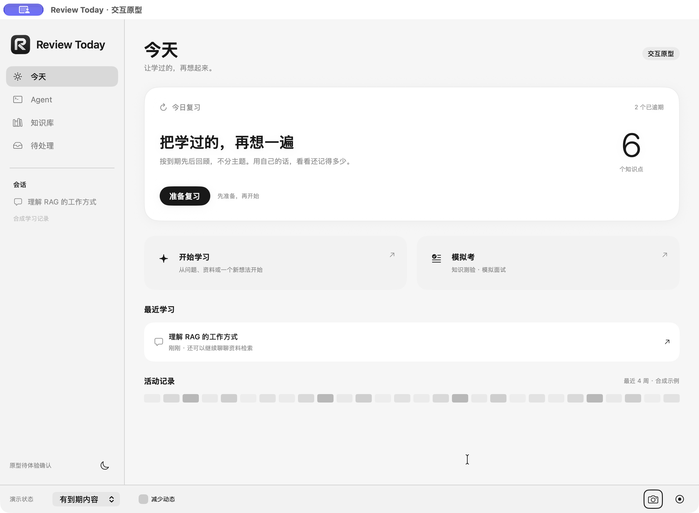
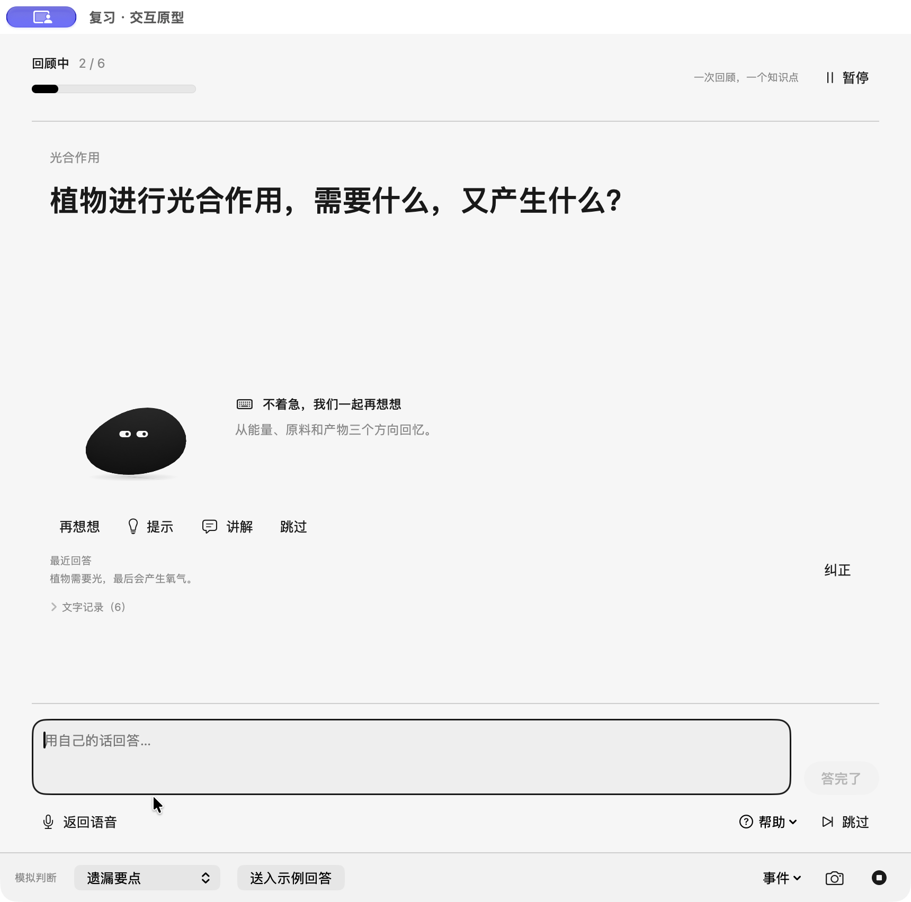

# 今天＋语音复习：原生交互原型

状态：独立原型已实现；原生操作及状态检查已完成，**待 Rex 视觉与交互体验确认**。不代表正式接入或 M1 放行。

**最新预选与小结修订：**小结去掉横线并恢复部分完成时的 Spine 动作；玻璃入口补入扫光、亮闪与持续高光。46 项状态检查和原生增量证据见 [第五次修订](motion-feedback-r5/README.md)。⌘3 可重复演示玻璃预选，真实鼠标悬停手感仍待实测。

**最新复习小结：**主卡与 Mr. B、独立结果卡、后续安排列表及固定操作区已按今天页风格重排，见 [小结页修订](summary-r4/README.md)。

**最新材质试验：**「开始学习」「模拟考」两块入口采用系统原生玻璃，浅深色截图、原速交互录像及检查边界见 [玻璃入口试验](entry-glass-r3/README.md)。

**最新今天页已按视觉反馈修订：**复习主卡旁增加独立状态块，恢复三条可展开的最近学习和原有 26 周热力图。最新截图、三段原速录像与增量验证见 [今天页第二版](today-layout-r2/README.md)。下面今天页截图属于首轮，复习窗口证据仍适用。

## 打开与体验

本机可直接打开 `output/today-review-prototype/TodayReviewPrototype.app`，名称为「Review Today · 交互原型」，独立标识 `Rex.Review-Today.TodayReviewPrototype`。重建：

```sh
tests/mac/run-today-review-prototype.sh
```

推荐体验路径：

1. 「今天」底部切换六种演示状态，复习主区始终保留；学习／模拟考始终位于主区下方。
2. 「准备复习」打开独立窗口。先选全部到期、时长或数量；后两种初始值均为 5。只有主动开始才进入语音状态演示。
3. 「开始语音」后用底部「送入示例回答」体验；「模拟判断」决定结果，不分析任意输入。也可展开文字，直接输入并用 ⌘Return 提交。
4. 可选遗漏、核心误解、回忆困难、需澄清；请求提示或讲解，再继续。提示后的正确回答仍保留首次回忆，讲解后无需强制重考。
5. 「事件」可模拟语音失败、时间到、保存失败，以及长题、深色、减少动态。语音失败自动聚焦文字；返回语音需主动操作。
6. 关闭复习窗口会暂停，今天可继续原轮次。应用本次运行内保留进度；**退出整个原型后合成进度重置**。
7. 「模拟考」只选择知识测验／模拟面试，说明后续范围，不进入试题或成绩。

原型菜单提供：⌘1 今天、⌘2 复习、⌘0 默认尺寸、⌘9 最小尺寸、⌘S 截图、⌘R 原速录制、⌘W 关闭窗口。答题时 Escape 暂停；帮助弹层可用 Tab、方向键、Return／Space，关闭后文字模式恢复输入焦点。

## 隔离与实现边界

- 只有合成知识和可控展示状态；不请求模型、不采音、不播放语音、不写数据库或正式复习记录。本轮真实模型调用量和费用均为 0。
- 复用真实 Runway 组件、侧栏主导航、品牌标记，以及 `MascotMotion.html` / `MrBMotion.html` 本地资源；语音画布只调整原生取景，不新画角色。无联网动画资源。
- 模型、后端、FSRS、日常 App 和现有 Jev 测试 App 的运行配置未修改。构建链接现有共享组件依赖，但原型入口不初始化业务服务或数据库。
- 知识库为合成开关的去向预览，学习为现有 Agent 的去向说明；本轮不把点击接到真实会话。正式接回时再复用当前 App 路由。
- 结果与日期是展示样例。工程契约验证的是状态关系、取消和计数，**不证明模型评价或排期准确率**。
- 窗口内容尺寸：今天默认 1160×820、最小 940×640；复习默认 860×820、最小 700×650。长内容可以滚动，底部主要操作保留。

## 首轮截图

| 场景 | 原生截图 |
|---|---|
| 无知识／未加入／未到期 | [无知识](today-empty.png) · [未加入](today-unenrolled.png) · [下次安排](today-scheduled.png) |
| 到期／暂停／本轮结束 | [到期](today-current.png) · [暂停优先](today-paused.png) · [结束后仍可复习](today-finished.png) |
| 模拟考 | [知识测验](exam-knowledge.png) · [模拟面试](exam-interview.png) |
| 准备 | [全部到期](preparation-all.png) · [数量目标](preparation-count.png) · [最小准备窗口](preparation-minimum.png) |
| 作答与帮助 | [语音状态](review-listening.png) · [情境帮助](review-help.png) · [讲解](review-explaining-dark.png) |
| 故障、纠正与恢复 | [自动转文字](voice-failure-text.png) · [纠正后保持进度](correction-keeps-progress.png) · [暂停恢复](review-paused-dark.png) |
| 小结 | [部分完成](summary-partial.png) · [全部处理](summary-complete.png) · [时间到先保存当前题](summary-time-limit.png) |
| 窗口与辅助操作 | [今天最小窗口](today-minimum.png) · [复习最小深色／长题／减少动态](review-minimum-dark-reduced.png) · [键盘帮助弹层](keyboard-help.png) · [保存失败](save-failure.png) |





## 原速交互录像

均为本原生进程窗口的 ScreenCaptureKit 录制，目标 30 fps，使用实际时间戳；没有加速、补帧或配音。只录自身窗口，无桌面／麦克风音轨。原始元数据及逐文件完整解码结果见 [video-validation.json](video-validation.json)。

- [01 模拟考选择](01-exam-selection.mp4)：两种模式及返回今天。
- [02 作答→帮助→转题→小结](02-answer-help-summary.mp4)：文字展开、输入、判断、保存后自动推进、提示、跳过和未完成结果。
- [03 关闭与恢复](03-close-resume.mp4)：同一轮次暂停和恢复，纠正后的结果没有重复计数。
- [04 正确与完整收尾](04-complete-ending.mp4)：认可动作、先显示小结再进行非阻塞收尾。
- [05 讲解与打断](05-explain-interrupt.mp4)：讲解文字即时可用、播报状态、打断变静态、直接继续下一题。
- [06 最终键盘路径](06-keyboard-help-answer.mp4)：Tab 到帮助、Return 展开、方向键／Space 选澄清、自动恢复文字焦点、提交与自动转题。此片包含本轮最后修订的帮助弹层。

## 验证结果

[41 项展示状态检查](state-contracts.txt)通过，独立原型构建及签名校验通过，`git diff --check` 通过。状态检查复跑：

```sh
xcrun swiftc -parse-as-library -swift-version 5 -default-isolation MainActor \
  tools/today-review-prototype/PrototypeState.swift \
  tests/mac/TodayReviewPrototypeContracts.swift \
  -o /tmp/today-review-prototype-contracts
/tmp/today-review-prototype-contracts
```

实际原生检查已覆盖：六种今天状态、两种考试选项（鼠标与键盘）、准备目标、输入聚焦、快捷提交、保存后自动转题、帮助后结果、讲解与打断、纠正计数、关闭恢复、语音失败转文字、重复点击、保存失败重试、时间到先提交、默认／最小窗口、浅深色、长题、减少动态，以及关键按钮和帮助弹层的键盘路径。辅助功能树确认题目更新、进度、禁用态、选中态和输入标签。

未验证：完整 VoiceOver 听读、Switch Control、其他显示缩放／系统版本和真人语音体验。原型本身不采音，所以这里不评估语音识别、回声消除、模型准确性、真实落盘或排期。Rex 的视觉与动效接受仍待确认。

## 本轮发现与修正

1. 独立包缺少品牌资源 → 编译现有品牌图集并随包提供。
2. 语音动作画布里的 Mr. B 过小 → 只调整原生取景，保持既有动作。
3. 文字展开时焦点早于控件挂载 → 在控件挂载后设置焦点；已实际粘贴与提交复测。
4. 帮助按钮标题压缩、辅助功能树保留上题文本 → 固定按钮内容尺寸并重新绑定题目显示身份；实际转题已复查。
5. NSHostingView 覆盖窗口最小尺寸 → 视图与窗口同时声明最小内容尺寸；重新验证 940×640／700×650。
6. 系统“所有控件”键盘导航关闭时，部分自定义按钮与帮助菜单不可激活 → 原型明确提供焦点、Return／Space 和原生弹层，重新验证焦点回到输入。
7. 纯跳过没有可纠正的转写 → 不提供伪造原回答的纠正入口，新增状态检查。

初轮截图、未完整跑完的原始 90 秒录制保留在 [iterations](iterations/)；它们不作为最终布局／流程通过证据。旧录像中的原生帮助菜单已由最终键盘弹层替换，最终操作见第 06 段。文件重命名映射见 [capture-map.json](capture-map.json)。曾出现电脑使用工具返回不完整截图，改用本原型自身窗口截图核实，不将工具图像缺失当作页面渲染结论。
