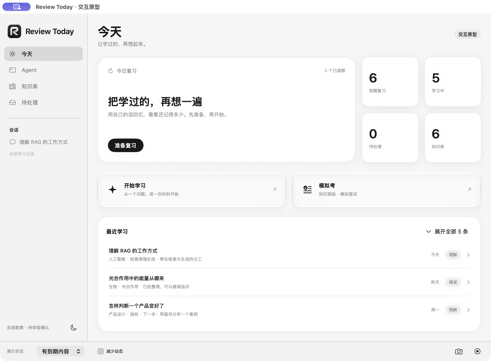

# 今天页：两个入口的原生玻璃试验

按 Rex 的指定，将「开始学习」「模拟考」的表面改为系统原生 Liquid Glass。尺寸、文字、圆角及去向保持现有设计。仅用于独立原型，待 Rex 实看确认。

原型：`output/today-review-prototype/TodayReviewPrototype.app`，打开「今天」即可看到。底部相机保存当前窗口，侧栏日月按钮切换浅深色；⌘9 最小窗口、⌘0 默认窗口。

## 效果与交互

[深色](dark.png) · [键盘焦点](keyboard-focus.png) · [最小窗口与减少动态](minimum-dark-reduced.png)

[原速交互录像](entry-interactions.mp4)：64.795 秒，包含学习／模拟考点击去向、深色切换、Tab 焦点和 Space 激活。使用本进程 ScreenCaptureKit 原始时间戳，无变速或音轨；完整解码通过，见 [录像元数据](video-validation.json)。[原始命名对应](capture-map.json)保留截取顺序。

## 实现与检查

使用 SwiftUI `glassEffect(.regular.interactive(...), in:)`，原生材质负责边缘和指针反馈；移除原先纸面底色和覆盖玻璃的按钮洗色。减少动态关闭交互形变；减少透明度使用不透明纸面。接口依据 Apple 的 [glassEffect 文档](https://developer.apple.com/documentation/swiftui/view/glasseffect(_:in:))及[自定义视图指南](https://developer.apple.com/documentation/SwiftUI/Applying-Liquid-Glass-to-custom-views)。

- 原型构建、签名校验及 `git diff --check` 通过；运行环境 macOS 27.0，部署目标 26.5。
- 实际打开原生窗口检查浅深色、两处点击导航、Tab 焦点与 Space 激活。
- 检查默认 1160×820 和最小 940×640 内容尺寸，最小窗口滚动后两块入口完整可见，无横向截断。
- 实际启用原型「减少动态」并检查深色最小窗口；未实测系统「减少透明度」、VoiceOver、Switch Control 或其他系统版本。
- 本次仅改材质，未新增或重跑既有 41 项状态测试；上一版状态验证不作为本次玻璃视觉验收。正式 App、数据及模型未更改。

原生检查完成不代表视觉接受，最终材质由 Rex 体验决定。
