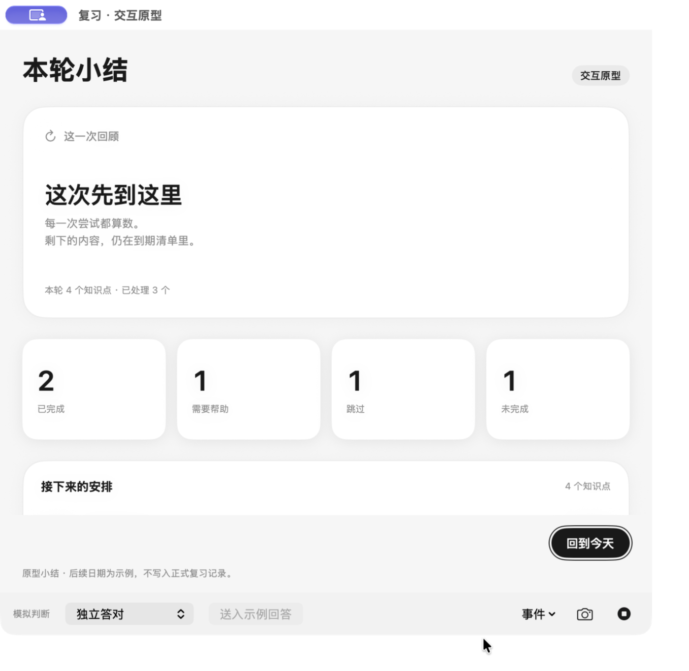
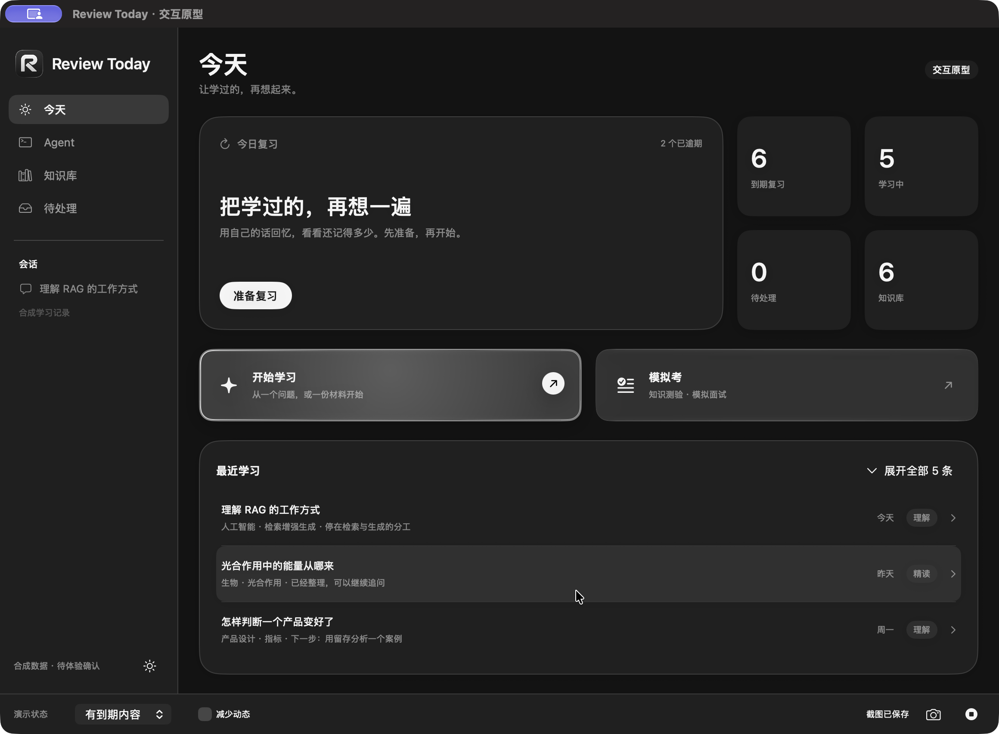

# 小结与玻璃预选：第五次修订

状态：独立原型已实现，构建及增量检查通过，待 Rex 体验确认。日常 App、数据和模型配置未改变。反馈只包含流光和亮闪，不播放声音。

## 实际变化

- 小结撤掉每条安排之间的横线及重复底部分隔，依靠留白、图标与日期对齐。
- 部分完成原先因为强制减少动态，只显示静态 `reaction_rest`；现在播放现有 Spine 鼓励动作。空结果使用示意动作，完整完成仍使用原有收尾，扩大其展示空间。
- 播放进度留在原型状态中，窗口重排不会从头播放；关闭或开始纠正取消旧动作，重开不会补播。减少动态使用现有代表姿态。
- 两个入口继续使用系统 Liquid Glass：进入时一次约 720ms 的银白斜向扫光和局部亮闪；预选期间保留高光、细亮边和箭头反馈。文字在光效上方。离开或跳转清理动效，不循环闪烁。
- 键盘预选使用静态高光与明确焦点环；减少动态关闭扫光、形变与箭头位移。减少透明度使用实底和描边。

## 打开与复看

打开 `output/today-review-prototype/TodayReviewPrototype.app`，进入「今天」，将鼠标移到「开始学习」或「模拟考」。原型菜单另提供 **⌘3 切换入口流光演示**，依次预选学习、模拟考、清除；它驱动相同视觉状态，用于重复评审光效，不代替真实鼠标命中测试。

底部「今天状态」选择「本轮结束」，点击「查看本轮小结」可看部分完成。完整收尾：准备复习 → 按数量设为 1 → 用文字开始 → 送入示例回答，模拟保存后自动进入小结。

## 原速录像

均为原生窗口 ScreenCaptureKit 原始录制，目标 30fps、实际时间戳、无音轨，无加速或补帧；三个文件均已完整解码检查。参数见 [video-validation.json](video-validation.json)。

- [01 部分完成、缩放与关闭重开](01-partial-resize-reopen.mp4)：9.93 秒，已有鼓励动作，重排和重开后无重复演出。
- [02 独立答对、自动小结与纠正](02-complete-correction.mp4)：34.79 秒，实际原型作答流程；能看到拿章、盖章和收回，之后进入纠正及缩放。
- [03 玻璃预选浅深色、快速切换和点击中断](03-glass-light-dark-interrupt.mp4)：32.01 秒，**由 ⌘3 受控预选触发**，不是实际鼠标悬停录像。入口在动画中仍可立即打开。

## 截图

| 场景 | 原生截图 |
|---|---|
| 浅色预选 | [学习](glass-learning-light.png) · [模拟考](glass-exam-light.png) |
| 深色预选 | [学习](glass-learning-dark.png) · [模拟考](glass-exam-dark.png) |
| 最小窗口／减少动态 | [静态反馈](glass-minimum-reduced-dark.png) |
| 小结 | [部分完成](summary-partial-light.png) · [最小窗口](summary-minimum.png) · [完整完成](summary-complete.png) |
| 小结深色 | [纠正后静态姿态](summary-dark-after-correction.png) · [减少动态](summary-reduced-dark.png) |

## 验证与边界

- [46 项状态检查](state-contracts.txt)通过；新增覆盖部分完成动作、播放进度、关闭重开不补播和纠正中断。独立原型构建、签名、差异格式检查通过。
- 原生已检查：小结部分／完整／空结果、浅深色、默认／最小窗口、关闭恢复、纠正后的输入定位；两个入口点击与键盘打开、焦点环、受控预选切换和中断、减少动态。
- **未验证**：真实鼠标自由悬停、跟随高光及快速进出手感。当前 UI 自动化没有鼠标自由移动接口；中键／拖动尝试不能证明悬停，因此保留在 `iterations/`，不算通过证据。Rex 可以直接在已打开的原型上复核。
- 系统「减少透明度」、VoiceOver、Switch Control 和其他系统／显示缩放未实测。代码中保留对应材质降级和按钮语义。
- 原型不采音、不播放提示音、不调用模型，不保存正式成绩或改动排期。工程检查不代替视觉接受和正式接入。

## 参考与采用范围

浏览了 [Shine Card 公开演示](https://animate.blockiesui.com/animations/shine-card)，只借鉴斜向扫光和局部高光的视觉／交互；其 Web 包、付费源码和资产均未使用。基础材质沿用 [Apple 原生 Liquid Glass](https://developer.apple.com/documentation/SwiftUI/Applying-Liquid-Glass-to-custom-views)，额外反射使用本地 SwiftUI 实现，没有新增依赖。Uiverse 检索返回的预览链接为 404，未作为已验证参考或采用组件。
