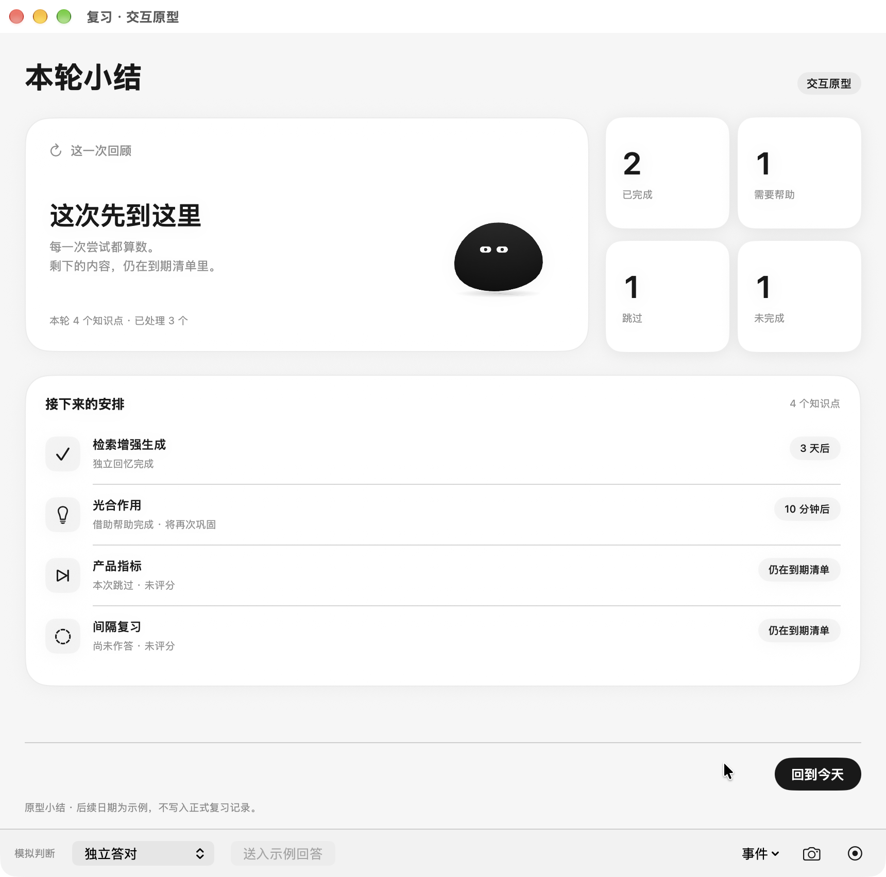

# 复习小结：与今天页统一的纸面布局

状态：独立原型已实现并完成定向原生检查，待 Rex 视觉确认。仅调整展示，不接真实模型、麦克风、数据库或正式评分。

打开 `output/today-review-prototype/TodayReviewPrototype.app`，在「今天」底部选择「本轮结束」→「查看本轮小结」。⌘9 查看最小窗口、⌘0 恢复默认；「事件」可切换深色与减少动态。

## 设计变化

- 状态与 Mr. B 放进同一主卡，右侧使用今天页的独立数字卡；小窗口把数字卡移到下方。
- 后续安排收进列表卡，统一知识点、回忆表现、日期标签与分隔线的对齐。未作答项也列出，和未完成数量对应。
- 返回、纠正及手动改判放在固定底部。纠正时可键盘操作，打开输入或缩放窗口会定位到编辑区域。
- 保持原有成功条件与角色动作；部分完成、无回答、跳过不会被写成全部成功。“需要帮助”独立计数，不暗示它必然是完成数量的子集。

[深色](partial-dark.png) · [完整完成](complete-light.png) · [无回答](empty.png) · [放大窗口](empty-expanded.png) · [最小窗口／减少动态](minimum-dark-reduced.png) · [窄窗完整列表](minimum-dark-list.png) · [纠正输入保持可见](correction-minimum-visible.png) · [纠正后的记录](corrected-minimum.png) · [手动改判](manual-grade.png)

## 实际验证

运行于 macOS 27.0、arm64；复习窗口默认内容 860×820，最小 700×650，另检查原生放大窗口。原型构建、签名校验、`git diff --check` 和既有 41 项状态检查通过。

实际操作覆盖：浅深色与减少动态；部分完成的 2／1／1／1、单题完整完成、无回答的 0／0／0／4；默认与窄窗重排及列表滚动；Tab／Space 返回今天并重开；Tab／Return 打开、确认纠正；较长纠正文案；手动改判更新日期但不增加已处理数量。帮助后的原始结果在纠正后仍保留；当前日期均为原型示例。

首轮发现：先展开纠正再缩小窗口时，输入焦点还在，但滚动位置停在页首，输入不再可见。将纠正定位同时绑定编辑状态与视区尺寸后，按同样路径复测通过。首次[问题截图](iterations/correction-offscreen-on-resize.png)和[原速录像](iterations/02-initial-correction-resize.mp4)保留，不作为最终通过证据。

原速录像仅录本原型窗口，使用真实时间戳，无音轨、无变速；逐段完整解码通过，详见 [元数据](video-validation.json)。

- [01 布局与重排](01-layout-reflow.mp4)，49.27 秒：最小窗口、深色、减少动态、列表滚动、恢复默认尺寸。
- [02 最终纠正路径](02-correction-resize-final.mp4)，27.20 秒：展开纠正→缩小窗口→输入保持可见→键盘提交→更新同一次记录→手动改判。

本次未实测 VoiceOver、Switch Control、其他系统版本或真实复习服务。模拟内容和原型操作不代表正式评分、排期或语音体验验收。最终视觉与使用感受由 Rex 确认。
