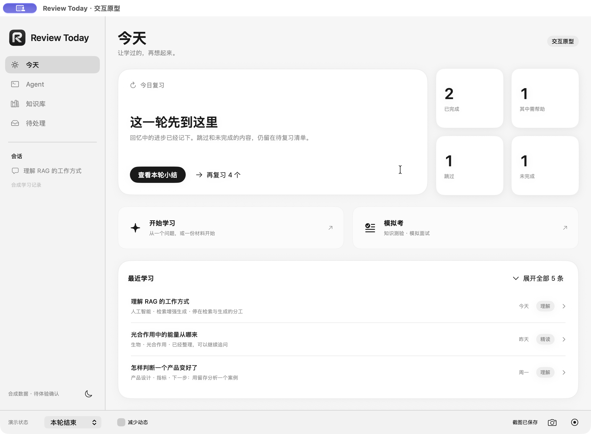
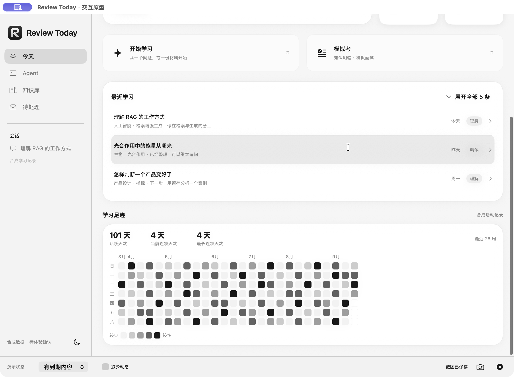

# 今天页视觉反馈修订

状态：原型修订完成，原生增量自测完成，**待 Rex 视觉体验确认**。本次只修改独立原型的今天页与合成记录去向，不接入日常 App。

## 这次调整

- 将复习文案和主操作放在主卡，右侧使用四张独立纸面状态卡。结束时分别显示完成、其中需帮助、跳过、未完成；保留原有计数关系。
- 状态卡沿用已有 StatStrip 的 Runway 纸面、圆角、阴影和数字层级；不把所有内容做成同样大小的格子。窄窗将四张卡移到主卡下方，仍可滚动阅读后续内容。
- 最近学习恢复一个完整内容块，默认三条，含主题、停留进度、模式和时间；展开后在限定高度内浏览五条合成记录。点击记录进入对应话题的预览。
- 直接复用现有 TodayActivityHeatmap，恢复 26 周、月份、星期、强度图例、活跃与连续天数、日期明细及对应去向。没有读取、删改真实学习历史。
- 最近复习以知识点、该次表现和下次安排展示，不用一行汇总数字代替内容。

## 实际界面

| 状态 | 截图 |
|---|---|
| 到期／结束／暂停 | [到期](today-due.png) · [结束](today-finished.png) · [暂停](today-paused.png) |
| 无知识／未参与／未到期 | [无知识](today-empty.png) · [未参与](today-unenrolled.png) · [未到期](today-scheduled.png) |
| 最近学习与对应话题 | [列表与热力图](recent-and-heatmap.png) · [HTTP 对应话题](recent-http-destination.png) · [键盘打开 RAG](keyboard-learning-dark.png) |
| 日期及知识明细 | [日期活动](heatmap-details.png) · [对应知识](knowledge-preview.png) |
| 窗口与主题 | [最小窗口](minimum-finished.png) · [深色与减少动态](minimum-dark-reduced.png) · [窄窗下方内容](minimum-dark-records.png) |

## 原速录像

仅录原型自身窗口，无音轨，无倍速或补帧。完整解码及元数据见 [校验结果](video-validation.json)。

1. [最近学习与热力图](01-recent-heatmap-navigation.mp4)，41.47 秒：展开、滚动到第五条、对应会话、26 周热力图、日期明细、对应知识。
2. [状态切换](02-today-states.mp4)，33.80 秒：结束、暂停、无知识、未参与、未到期。
3. [键盘、窗口重排与减少动态](03-keyboard-reflow-reduced.mp4)，29.32 秒：深色和减少动态下用 Tab／Return 打开 RAG 对应记录、返回、默认／最小窗口切换。

## 验证范围

环境：macOS 27.0、Apple Silicon；默认内容尺寸 1160×820，最小 940×640。独立构建、签名校验、`git diff --check` 通过。

原生运行中已检查六种今天状态、三条／展开五条、独立列表滚动、鼠标打开第五条 HTTP 会话、键盘打开 RAG、热力图日期及工作记忆知识明细、浅深色、默认／最小窗口、减少动态、复习准备入口和模拟考选择入口。辅助功能树可读到卡片数值与标题、记录按钮、展开状态和日期活动数。截图经实际查看，三段视频完整解码通过。

本次未更改复习状态机，未重复执行上一版 41 项状态检查，也未重新执行完整语音复习场景。完整 VoiceOver／Switch Control 未运行；其他系统版本、显示缩放与正式 App 接入未验证。原型完整流程的首轮证据仍见 [上一级记录](../README.md)。

## 直接体验

打开 `output/today-review-prototype/TodayReviewPrototype.app`。当前停在「今天／本轮结束」，可直接对照反馈中的四项数字。底部可切换其他状态；向下滚动查看最近学习、最近复习和学习足迹。热力图及学习列表均为合成示例，模型、麦克风、数据库和正式排期不参与。

原始文件名与当前名称的映射见 [capture-map.json](capture-map.json)。首轮截图保留，不覆盖历史证据。
