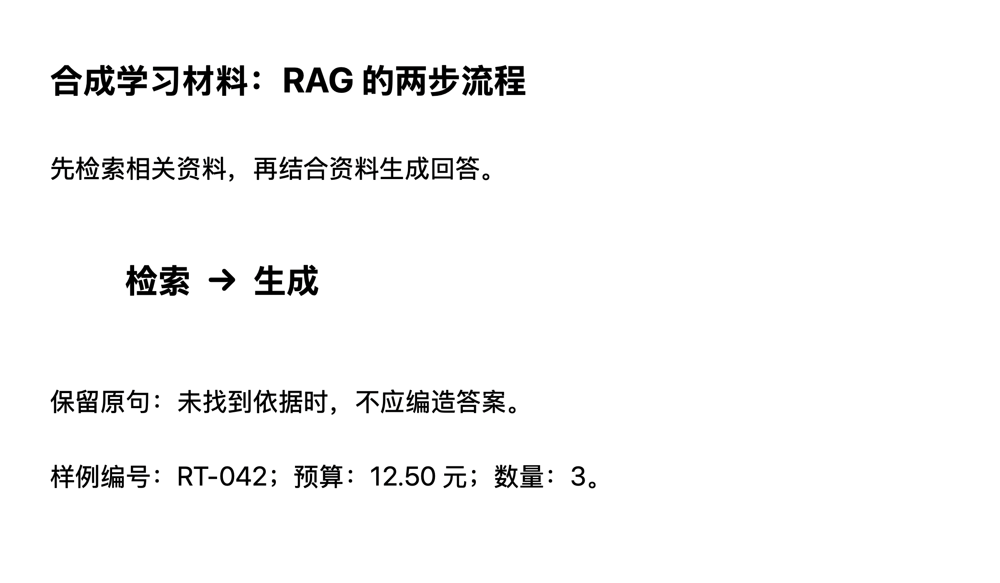

# 图片学习输入验证记录

2026-09-26。最新状态：单图已扩展为每条最多 8 张，代码和定向工程检查完成；多选／粘贴、草稿恢复、原生两图在线回答及追问已验证，真实跨窗口拖入和 Rex 体验验收尚未完成。下面保留首轮单图与日常替换历史，最新结果见「多图与拖入增量」。Jev 开关未改变，不把本记录视为正式发布或 M1 验收关闭。

## 本次实现

Agent 的「＋ → 添加图片」和输入框粘贴支持每条消息一张 PNG/JPEG；截图粘贴可从 TIFF 转换。添加后可查看、按实际大小滚动、移除或替换，不自动发送。图片独立发送使用默认问题，附带问题时保留原始文字。未发送草稿按会话保存，已发送图片附着在原消息处；本地保存失败保留草稿，网络失败保留待投递消息。归档／删除／清空沿用原生命周期。

Flash 在同一次入口调用中返回意图和图片识读，分别记录文字、视觉关系、不确定项。后续准备、讲解和材料分析接收带来源标记的文字；成功识读后的追问和恢复不再上传原图。未识读的图片恢复时按消息 ID 和摘要取回 Mac 原图。Jev 与 Pro 不接收图片字节，没有新增 OCR 或每图固定 Jev 调用。结构输出沿用 JSON Schema、服务端校验与一次修复，格式正确不等于识读事实正确。

图片限制为 8 MiB、单边 8192 像素；原图不静默缩小或裁掉文字。重新编码去掉源路径、定位、拍摄时间等私有元数据，保留必要的尺寸／色彩数据。字节不进入向 Mac 同步的 checkpoint、事件和诊断；同一消息不同图片被判定为幂等冲突。服务不支持图片时提示重启并保留附件。

## 工程验证

| 检查 | 实际结果 |
| --- | --- |
| macOS Debug 隔离构建 | `xcodebuild` 退出 0；独立包 ID `Rex.Review-Today.Image.NativeQA` |
| 图片与相关 Python 定向回归 | 149 passed，8 subtests passed；其中图片契约 17 项 |
| Python 全量受控回归 | 836 passed、2 failed、4 skipped，354 subtests passed |
| 修改前基线复现 | 同一两个失败在 `f872df7` 的临时副本中复现，未以跳过测试处理 |
| 原生契约 | 7 组通过：ImageInput、LearningInput、IndependentSession、LocalDataReset、AgentServiceMonitor、ConversationReplay、AppRuntime |
| 原生实际 SSE 接收 | Unicode 增量接收通过；受控样例最大接收延迟 25 ms |

图片契约覆盖真实 Responses 图片内容结构、格式／摘要拒绝、消息幂等、输入容量、一次结构修正、取消后的迟到结果、成功步骤缓存、去字节的快照恢复、识读后中断恢复、文字追问不重传图片、图片私密文本的公开查询阻断。原生契约覆盖元数据清理、体积上限、图片草稿归属、首条消息失败回滚、图片独立草稿迁移、磁盘重开、归档／删除及原生粘贴回调。`.NativeQA` 缺隔离参数时拒绝进入日常库。

两个既有失败均来自 `test_closure_repair.py`：刷新材料后版本仍为 1（期望 2），混合材料缺少 `agent_generated` 来源身份。见 [基线失败输出](baseline-failures.txt) 与 [检查摘要](verification.txt)。全量结果产生后，新增的图片隐私检查及其变量修正重新通过 149 项相关回归；未再次重复全量执行。构建／测试中的既有 API 弃用告警仍保留。

可重跑的受控命令：

```sh
bash agent-service/run-controlled.sh
bash tests/mac/run-contracts.sh ImageInputContractTests LearningInputContractTests IndependentSessionContractTests LocalDataResetContractTests AgentServiceMonitorContractTests ConversationReplayTests AppRuntimeContractTests
```

## 真实 Flash 回放

使用自己绘制的 [合成图片](fixture.png)，内容包含 RAG 的「检索 → 生成」、编号 `RT-042`、`12.50 元`、数量 `3`，以及「未找到依据时，不应编造答案」。文件 SHA-256：`e2e812a1f981bbbd12abfdc979233fec8f5ec79394509c710731265250ae1e04`。未上传私人截图。



两个独立回放均使用真实配置中的 DeepSeek 服务、临时数据库、关闭 Jev／搜索／浏览器；模型没有替身。测试包装器只记录模型调用，并关闭后台会话摘要以稳定归因。它不是完整原生 App 的端到端测试。

| 回放 | 首轮总耗时 | 追问总耗时 | 首轮输入／输出 token | 追问输入／输出 token |
| --- | --- | --- | --- | --- |
| [第一次](live-1.json) | 14.591 秒 | 9.228 秒 | 16638 / 984 | 16173 / 492 |
| [提示规则细化后](live-2.json) | 12.607 秒 | 7.740 秒 | 16697 / 949 | 16210 / 456 |

每轮均有 3 次模型调用。首轮为识图与意图、教学准备、回答；追问为文字意图、教学准备、回答。每个回放只有首次调用携带图片。入口请求 `deepseek-flash`，回答请求 `deepseek-v4-flash`，供应商在用量中均报告 `deepseek-flash`。表中 token 为供应商报告的全轮合计，输入包含缓存命中；它不是图片单项费用或成本节省证明。

两次均正确识别所检查的中文、数字、否定词和箭头方向；追问保留「不应」，没有重传原图。模型仍会把缺少额外图例等背景当成不确定项，并在「只引用原句」时添加泛化核对提示。规则已要求仅保留具体疑点，但实测尚未完全遵循，因此文风／指令遵循不记为通过。没有完成手写、模糊图、密集表格、公式或复杂图表的质量评测，也没有 OCR 对照，不能据此宣布 Flash 普遍更准确或成本最优。

真实回放入口（会调用当前已配置模型并产生用量）：

```sh
cd agent-service
PYTHONPATH=. .venv/bin/python tests/image_inputs_real_smoke.py --live --image ../docs/evidence/2026-09-26-image-input/fixture.png --output /tmp/review-today-image-live-new.json
```

输出文件必须不存在；脚本不覆盖旧证据。使用已有项目模型环境运行，不输出或复制凭据。

## 原生 UI 复核

按 Apple UI Review 的运行证据要求检查独立测试包，复用现有导航、菜单、输入框与 sheet，没有新增设计方向。会话截图及 AX 状态直接在当前 Codex 任务中检查，未另存截图文件。

- 文件选择、粘贴、缩略图、移除、适配预览、实际大小滚动与 Escape 关闭均实际操作；附件没有自动提交。
- 浅色和深色已查看。初次观察发现历史图片与用户气泡错位，修正右对齐后重新构建、启动并确认。
- 图片独立发送产生一条本地消息；服务离线时可见「连接中断，内容已保留」，原图可回看。重启后历史图片仍存在。
- 中文问题与图片共同保留；切换到新会话无旧图，返回原会话恢复图片与文字草稿。中文文字通过 AX 设值检查，不能替代真实中文输入法组合态测试。
- 无完整 VoiceOver、窄窗口、Reduce Motion／Transparency 路径证据；窗口拖动未得到可确认的尺寸变化。第二次重启准备复查未发送草稿时 Mac 锁屏，此项 UI 复验停止，磁盘草稿恢复另有原生契约证据。

**原生在线阻塞**：隔离测试包的 Python 子进程在初始化的 `Py_InitializeFromConfig → getpath_readlines → fopen/open` 阶段停留，尚未进入图片业务代码，健康端口没有就绪。已有限重试与采样，但没有证据确认具体系统权限原因；没有更改系统权限、接管日常服务，或把 CLI 单独调用冒充原生闭环。因此图片从原生投递到真实回复、服务恢复后自动投递、完整流式回答和用户视觉验收仍未通过。

## Rex 的验收入口

在后台可正常启动的当前开发版，进入 **Agent → 新建会话 → ＋ → 添加图片**（或在输入框粘贴截图）：先查看／移除，再发送单图；另试附带问题。预期回答依据图中实际内容，数字与否定词不反转，看不清处明确说明。追问已读细节应接续回答；新细节若未被此前识读覆盖，应请求清晰局部图。切换会话、重启、归档回看时图片各归其所属记录。

首次实现回合只准备并运行隔离开发包，没有安装替换日常 App。后续日常开发版替换与可用状态见下一节；原生输入到真实回复的使用体验仍由 Rex 继续验收。

## 日常开发版替换（2026-09-26 16:46）

Rex 明确要求「替换一下，我需要去 APP 实测」后，以代码 `4063395` 构建正常 Debug 包，保留 `Rex.Review-Today` 身份与原 Apple Development 签名团队。签名校验通过；正常退出旧 App 和其托管服务后，把新版放回原 Xcode DerivedData 的日常启动路径，并打开原会话。临时图片验收包已退出。

替换前已将旧 App、SwiftData 数据和服务 checkpoint 留在本机 `Review Today/Backups/before-image-4063395-20260926-164610`。备份及重开后的数据库完整性检查通过，迁移前后原有表的记录数一致。未删除会话或重置知识库，也未向日常会话发送合成测试消息。

本次正常签名的日常 App 成功自行启动后台，`image_input_protocol=1`；Flash 意图、Flash 回答和 Pro 风险模型均 ready，回答流式能力 ready，Jev 为 off。摘要见 [日常服务状态](daily-runtime.json)。原生「＋」菜单已实际展开并确认出现「添加图片」，当前窗口保留在 Rex 原会话供实测。

该结果证明日常版本已替换且后台支持图片，不能代替原生上传到真实回答的完整质量验收；此前隔离包的初始化问题仍作为历史限制保留。

## 多图与拖入增量（2026-09-26）

Rex 要求参考 Codex，直接把多张图片拖入当前会话。本轮在会话正文和原生输入框接入图片拖放，拖入只追加到草稿；显示接收提示，准备完成后逐张预览／移除，用户发送时才调用模型。多选、重复粘贴和拖入共用同一队列，每条最多 8 张；待处理批次计入上限，按发起顺序发布。混入无效文件或超限时整批拒绝，已有图片和文字保留。切换会话／归档使旧批次失效。

原单图本地编码与 `image` 接口继续兼容，新多图使用 `images` 和图片协议 2。每个识读绑定消息 ID 和图片序号，反序返回也按原顺序归位。来源身份逐图区分，同话题追问的准备步骤复用图片来源，明确换话题时不继承。成功识读后不重复上传原图，仍使用 Flash 直接识图，没有增加 OCR／Jev 调用。

### 工程与真实模型

- 正常 Apple Development 签名 Debug 构建退出 0；未修改现有签名团队或模型凭据。
- 179 项相关 Python 测试及 8 subtests 通过，包括多图数量、顺序、重试幂等、结构修复、取消、恢复、私密内容、完整文字追问和新话题隔离。真实回放后又去掉首次教学准备中重复的图片来源文本，相关 55 项复测通过，历史来源仅在追问时补入。本次没有重跑全量；首轮两个既有失败的基线说明仍保留。
- 7 组原生契约通过；新增覆盖数组与旧编码、服务版本拒绝、多批异步顺序／取消／上限、多文件剪贴板、文本编辑器拖入回调、真实 NSItemProvider 的顺序与整批失败、多图保存失败回滚及磁盘恢复。原生事件回调测试不等同于跨 App 拖动手势。摘要见 [多图工程检查](multi-verification.txt)。
- [独立 Flash 回放](multi-live.json)：两图首轮 16.090 秒，文字追问 10.019 秒，各 3 次模型调用；只有首轮入口调用带 2 张图。两张合成图分别为 `RT-042 / 12.50 元 / 3 / 检索→生成` 与 `RT-043 / 18.75 元 / 5 / 生成→核对依据`，识读分别对应，否定句「不应编造答案」保留。第二张材料见 [fixture-2.png](fixture-2.png)。
- [原生 App 回放](multi-native.json)：使用正常开发签名、独立 `.NativeQA` 身份与临时数据，后台协议 2、Jev off、真实配置模型，无模型替身。首轮两图回答完成（22.248 秒），随后文字追问完成（13.673 秒），正确给出差额 `6.25 元` 和不允许编造答案。会话中的两张历史图片均可回看。没有把测试消息发入日常会话。

模型仍会附带多余的泛化谨慎提示；本次样例不证明所有图片都准确，也不是 OCR 成本／质量对照。

### 原生界面实际检查

在 macOS 27.0 的独立 App 中实际执行：Finder 多文件复制后 ⌘V 加入两张、连续追加到 8 张、再次添加被拒绝且已有文字／图片不变、逐张移除至两张；退出并重开后两张图和问题恢复；发送后收到上述真实回答。另由系统文件选择器多选两张加入草稿，第二张预览对应其实际内容，Escape 关闭；新建会话不带旧图，返回原会话恢复两张草稿。窄窗口（约 760 pt）三列附件、换行、长文件名截断、数量和错误提示已查看。

**未验证项**：自动化跨 Finder 窗口的拖动未产生已添加结果，原因未确定；不能据此声称 Finder 拖入、输入框拖入或悬停提示已在真实手势下通过。拖放底层原生回调／文件提供者契约已通过，仍需本机手势实测。未运行完整 VoiceOver、中文输入法组合态、多图深色及辅助显示偏好检查。没有新增拖放动画，减少动态无需等待动画。

实现依据：[SwiftUI onDrop](https://developer.apple.com/documentation/swiftui/view/ondrop(of:istargeted:perform:))、[AppKit performDragOperation](https://developer.apple.com/documentation/appkit/nsdraggingdestination/performdragoperation(_:))；文件提供者在 drop 回调内立即开始读取，不先延迟到异步任务。

### Rex 的多图验收入口

打开日常 App 的 **Agent → 任一活动会话或新会话**，从 Finder 选中 2–3 张 PNG/JPEG，分别拖到会话正文空白区和输入框。预期出现「松开以添加图片」，松开后缩略图追加到当前草稿，正文不插入文件路径、不自动发送；继续拖入、⌘V 或「＋ → 添加图片」多选可以追加。逐张移除、预览后提问并发送；超出 8 张时原草稿保持不变。拖入视觉和操作是否顺手由 Rex 确认，此项尚未关闭验收。

### 日常多图开发版替换（2026-09-26 18:24）

代码 `4cde95c` 的正常签名 Debug 包已替换到原日常启动路径，保持 `Rex.Review-Today` 身份与原 Apple Development 签名团队，签名校验通过。正常退出旧 App 及其托管服务后，旧 App、完整 SwiftData 数据目录和服务数据库已备份到本机 `Review Today/Backups/before-multi-image-4cde95c-20260926-182428`，再安装并打开新版。

重开后数据库完整性检查通过，全部业务模型表和服务表的记录数保持不变；SwiftData 的变更／事务历史表记录有所增长，未将它们误记为完全不变。日常后台 `image_input_protocol=2`，Flash 意图、Flash 回答及 Pro 风险模型均 ready，回答流式能力 ready，Jev 为 off。摘要见 [多图日常服务状态](multi-daily-runtime.json)。原会话已打开，未向日常会话发送合成测试消息；实际跨窗口拖入及最终使用体验继续由 Rex 验收。

### JPEG 拖入读取修正（2026-09-26）

Rex 的截图和日常 App 均显示「这批图片未添加：无法加载 public.jpeg 类型表征」。此前导入器遇到图片类型只调用 `loadDataRepresentation`，未尝试文件或旧式图片对象。受控回归保留 Foundation 的真实临时 JPEG 文件表示，仅让数据读取返回 `NSItemProviderErrorDomain/-1000`：修复前应用代码报出同样错误，修复后正常导入。该回归复现读取路径缺陷，尚不能确认用户原始拖动来源的具体系统行为。

现按来源已注册的格式依次尝试文件、数据及旧式对象表示；文件 URL 不可读时可继续尝试来源提供的实际图片。提供者保留到读取完成，临时文件在系统回调返回前读取，不把 URL 留给稍后的异步任务。有效图片超出大小或尺寸限制时仍直接拒绝，不降级使用预览绕过限制；没有新增远程图片 URL 下载。所有表示都不可用时给出可操作的中文提示，不直接显示 `public.jpeg` 系统错误。

图片与输入两组原生契约通过，涵盖仅文件可读的 JPEG、仅数据可读、旧式文件对象、首选格式失败、文件 URL 失败、整批超限拒绝、远程 URL 拒绝及原有多图草稿／队列行为。正常签名构建及签名校验通过；首次构建退出 0 但输出两条非图片文件的编译调度诊断，增量复核退出 0 且没有这些诊断。检查摘要见 [JPEG 拖入回归](jpeg-drag-fix.txt)。本次未改服务端和模型调用，未重复模型回放。

隔离原生拖放窗口的自动化手势仍未产生可确认的投递结果，不记为真实手势通过。用户原图、原来源拖入仍待实测确认。

18:43 已将 `04c708a` 的签名修复包替换到日常启动路径，并重新打开原会话。旧包及两份本地数据库已保存在 `Review Today/Backups/before-jpeg-drag-04c708a-20260926-184341`；备份与重开后的完整性检查通过，业务模型和服务记录数不变。后台图片协议 2、各模型角色 ready；见 [JPEG 修复版运行状态](jpeg-daily-runtime.json)。未发送测试消息或修改用户草稿。
